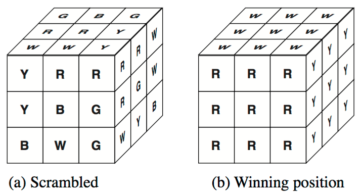
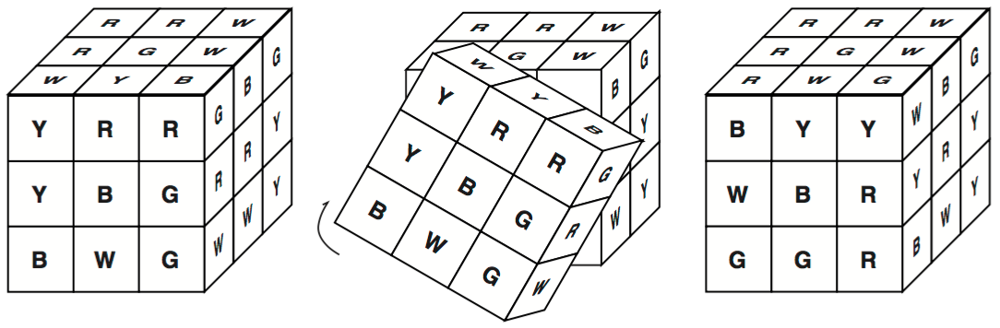
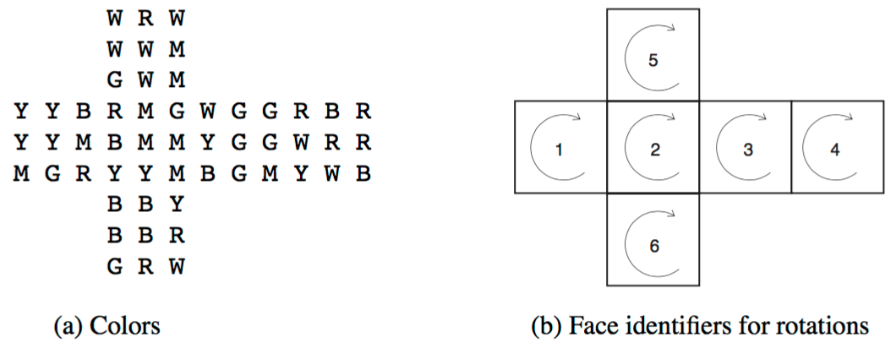

## 문제

A very well-known toy/pastime, called Rubik's cube, consists of a cube as shown in Figure 1a, where letters stand for colors (e.g. B for blue, R for red,...). The goal of the game is to rotate the faces of the cube in such a way that at the end each face has a different color, as shown in Figure 1b. Notice that,

Figure 1: Rubik Cube

when a face is rotated, the configuration of colors in all the adjacent faces changes. Figure 2 illustrates a rotation of one of the faces. Given a scrambled configuration, reaching the final position can be quite challenging, as you may know.

Figure 2: Rotation example

But your grandpa has many years of experience, and claims that, given any configuration of the Rubik cube, he can come up with a sequence of rotations leading to a winning configuration.

In order to show all faces of the cube we shall represent the cube as in Figure 3a. The six colors are Yellow, Red, Blue, Green, White and Magenta (represented by their first letters).

You will be given an initial configuration and a list of rotations. A rotation will be represented by an integer number, indicating the face to be rotated and the direction of the rotation (a positive value means clockwise rotation, negative value means counter-clockwise rotation). Faces of the cube are numbered as shown in Figure 3b. You must write a program that checks whether the list of rotations will lead to a winning configuration.

Figure 3: Representation of the cube

## 입력

The input contains several test cases. The first line of the input is an integer which indicates the num- ber of tests. Each test description consists of ten lines of input. The first nine lines of a test will describe an initial configuration, in the format shown in Figure 3a. The next line will contain a list of rotations, ending with the value 0.

## 출력

For each test case your program should print one line. If your grandpa is correct, print “Yes, grandpa!”, otherwise print “No, you are wrong!”.
