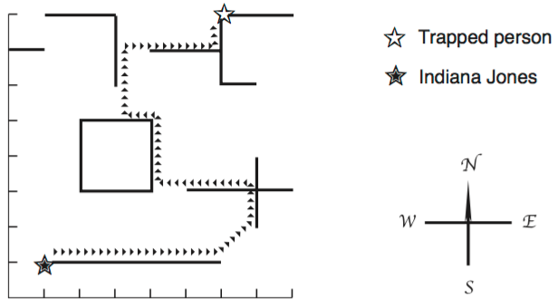

## 문제

Indiana Jones is in a deserted city, annihilated during a war. Roofs of all houses have been destroyed and only portions of walls are still standing. The ground is so full of mines that the only safe way to move around the city is walking over the remaining walls. The mission of our hero is to save a person who is trapped in the city. In order to move between two walls which are not connected Indiana Jones thought of taking with him a wooden board which he could place between the two walls and then cross from one to the other.

Fig. 1:City map with route used by Indiana Jones

Initial positions of Indiana Jones and the trapped person are both on some section of the walls. Besides, walls are either in the direction South-North or West-East.

You will be given a map of the city remains. Your mission is to determine the minimum length of the wooden board Indiana Jones needs to carry in order to get to the trapped person.

## 입력

Your program should process several test cases. Each test case starts with an integer N indicating the number of wall sections remaining in the city (2 ≤ N ≤ 1000). Each of the next N lines describes a wall section. The first wall section to appear is the section where Indiana Jones stands at the beginning. The second section to appear is the section where the trapped person stands. Each wall section description consists of three integers X, Y and L (–10000 ≤ X, Y, L ≤ 10000), where X an Y define either the southernmost point of a wall section (for South-North sections) or the westernmost point (for West-East wall sections). The value of L determines the length and direction of the wall: if L ≥ 0, the section is West-East, with length L; if L < 0, the section is North-South, with length | L |. The end of input is indicated by N = 0.

## 출력

For each test case in the input your program should produce one line of output, containing a real value representing the length of the wooden board Indiana Jones must carry. The length must be printed as a real number with two-digit precision, and the last decimal digit must be rounded. The input will not contain test cases where differences in rounding are significant.
