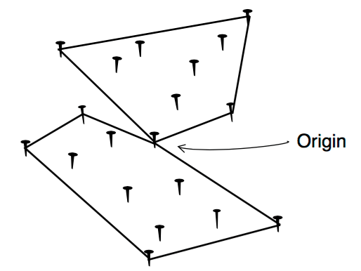

## 문제

Nails and Rubber Bands. That is the suggestive name of a game played by a group of children (all of them offspring of geometry teachers). The children fix a number of nails on a plank of wood, randomly placed. Then they choose one of the nails to be the Origin, and a number B of rubber bands. The challenge is to use the B rubber bands to wrap the nails so that (i) each rubber band wraps a subset of the nails; (ii) all nails are inside some wrapping; (iii) wrappings do not overlap each other except at the Origin nail, which is touched by all rubber bands; (iv) rubber bands must form wrappings which are convex polygons with at least three corners; and (v) the total area inside the wrappings is the smallest among all possible ways of wrapping the nails. An instance of the game is shown in Figure 1.

Figure 1: A game with 19 nails and 2 rubber bands

## 입력

Your program should solve several instances of the game. Each game description starts with a line containing two integers B and N, indicating respectively the number of rubber bands and the number of nails (2 ≤ B ≤ 50 and 2B+1 ≤ N ≤ 101). The following N lines describe the position of the nails, each line containing two integers X and Y (–10000 ≤ X, Y ≤ 10000). The origin is the first nail in the input. The end of input is indicated by B = N = 0.

In all instances in the input:

* no two nails are in the same point;
* no three nails are in the same line;
* the origin nail does not belong to the convex hull of all nails (that is, if you use one rubber band to wrap all nails, it does not touch the origin nail).

## 출력

For each game in the input your program should output one line, describing the smallest total area inside the wrappings. The area must be printed as a real number with two-digit precision, and the last decimal digit must be rounded. The input will not contain test cases where differences in rounding are significant.
