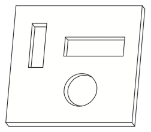

## 문제

Cheap small industrial scanners can only acquire images on gray scale, which are images where the pixels have intensity values in the integer range [0..255]. A company that builds automatic vending machines wants to use these small scanners to validate the tokens used in its machines. Tokens are small square chips of metal with holes strategically pierced. Tokens with different holes are used for different values.

Fig. 1: Token for a vending machine

A scanner will produce an image of the token introduced by the client and a computer program will validate it. In the scanner image, metal appears as dark pixels (values near 0) and holes appear as light pixels (values near 255). There are two problems that must be solved in the validation process. The first problem is that, since the token is square, a client can introduce it in the machine slot in several possible ways. The second problem is due to the poor quality of the image generated by those cheap scanners, which will contain ‘noise’ (errors). To validate the token, the machine will compare the scanner output to a ‘standard image’ of the token, previously produced using a high quality scanner.

You must write a program which, given the standard image of a token and an image produced by the machine scanner, determines the confidence degree that the token introduced is a valid one. The confidence degree is the percentage of pixels in the scanner image whose intensity value differ by 100 or less from corresponding pixels in the standard image. As the token may have been introduced in several ways, we are interested in the highest possible confidence degree, considering all possible token positions.

## 입력

Your program should process several test cases. Each test case specifies the size of the token image and the pixel values for the standard and scanned images. The first line of a test case contains an integer L that indicates the size, in pixels, of the image (1 ≤ L ≤ 400). The next L lines will contain L integers each, representing the pixel values for the rows of the standard image. Following that, the next L lines will contain the pixel values for the rows of the scanned image.

The end of input is indicated by L = 0.

## 출력

For each test case your program should output a single line containing the confidence degree for the corresponding image. The confidence degree must be printed as a real number with two-digit precision, and the last decimal digit must be rounded. The input will not contain test cases where differences in rounding are significant.
