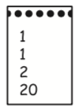
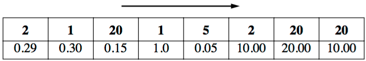

## 문제

Mr. Jones is an exemplary husband. Every Saturday morning Mrs. Jones gives him a list of goods to be bought from the supermarket and he buys exactly what he has been asked for, always choosing the brands with lowest prices. But Mr. Jones hates going to the supermarket on a Saturday, since its aisles are packed with shoppers. He wants to change the way he does his shopping. Instead of going to and fro to buy the products on his wife’s list, he will try to get the goods on the list going through each aisle only once, picking up the products in the exact order given in the list. So he asked you to write a program to help him with his new style of shopping.

Given the information about products available in the supermarket together with their prices in the order in which they appear in Mr. Jones’ way and the list of products given by his wife, your program must determine the least cost that he would pay.

Mr. Jones buys the products in the order in which they appear in Mrs. Jones’ list and he never goes back as he walks down the aisles. Therefore, if he buys the i-th product on his way as the j-th item on the list, the next product to be bought is the (j+1)-th item of the list – and it must be bought from the products that come after i in his path. The figure below shows an example where products are identified by integers. Note that different brands of the same product may appear separately. In the example Mr. Jones must buy products 1,1,2,20 (notice that product 1 appears twice in the list). For the example, the least cost for Mr. Jones following his constraints is 21.30. Notice that with this new way of shopping it may be impossible for Mr. Jones to buy all the goods on Mrs. Jones list; in that case, your program should warn Mr. Jones.

(a) Mrs.Jones’list

(b) List of products with respective prices, and order they appear on Mr. Jones’ way down the aisles

## 입력

Your program should process data for several shopping sessions. The first line in the description of a shopping session contains two integers M and N; M indicates the number of items in Mrs. Jones’ list (1 ≤ M ≤ 100) and N represents the total number of products available in the supermarket (1 ≤ N ≤ 100,000). The next line contains M integers Xi representing the list of products in Mrs. Jones’ list (1 ≤ Xi ≤ 100,000, 1 ≤ i ≤ M). Then N lines follow, representing the supermarket products in the order in which they appear in Mr. Jones’ way. Each of those lines contains an integer K and a real P which represent respectively a product identifier and its price (1 ≤ K ≤ 100,000). The end of input is indicated by M = N = 0.

## 출력

For each shopping session in the input, your program should produce one line of output, containing the least cost that Mr. Jones would pay. If it is not possible to buy all the goods for the session, print the word ‘Impossible’. The cost must be printed as a real number with two-digit precision, and the last decimal digit must be rounded. The input will not contain test cases where differences in rounding are significant.
