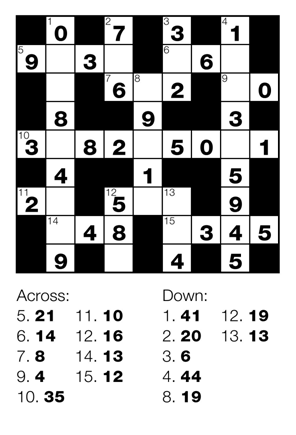

## 문제

Inspired by an infomercial trick, you bet your friend that you can code an app to solve a newspaper crossnumber puzzle faster than she can solve the puzzle by hand.

The puzzle is similar to a crossword, except instead of letters, each cell contains a digit from 0 to 9. Each clue gives the sum of the digits in the corresponding word. Since the puzzle is not meant to frustrate the readership, the puzzle is constructed in such a way that throughout the solution process there is always a word with exactly one unfilled cell.

## 입력

The input consists of many test cases. Each test case begins with an integer N (2 ≤ N ≤ 100), on a line by itself, which indicates the number of rows and columns in the square puzzle.

The description of each test case consists of:

* N rows that contain N characters each, which is the puzzle grid. The character '.' indicates an unfilled cell, the character '#' indicates a black cell, whereas a digit '0' to '9' indicates the value assigned to the cell as shown in the Sample Input below.
* a line containing the word "Across", and then
* one line for each across clue, which contains three integers: x y sum. “x” and “y” indicate the column and row numbers, respectively, and 1 ≤ x,y ≤ N. “sum” is the summation in that across or down.
* a line containing the word "Down", and then
* one line for each down clue formatted in a similar way to an across clue.

Each maximal sequence of horizontal or vertical non-black cells, of length at least two cells, will have exactly one associated clue listed for its top-left square, even if all of its non-black squares are already filled by hints.

A zero on a line by itself indicates the end of input and should not be processed.

## 출력

For each test case print the solved puzzle in the same format. Each solution should be followed by a blank line.
