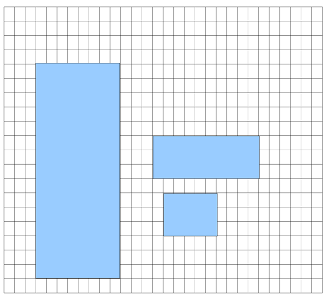

## 문제

The manager in charge of a large warehouse is expecting a large number of boxes to be delivered for storage.

The warehouse has the form of a rectangle with the bottom left corner at (0,0) and the top right corner at (Depth, Frontage). There are walls on three sides with the left side (the one along the y-axis) open.

When transporting a box to its designated storage location, movers are allowed to push it on the warehouse floor, to slide it along the side of another box, and to move it without touching any other box or warehouse wall. Movers are instructed not to rotate the boxes and that boxes should not collide with each other or the warehouse walls. Once a box has been placed in its assigned storage area, it cannot be moved again. If a box cannot be moved to its destination, then it is rejected and it will not hinder the placement of subsequent boxes.

## 입력

The input starts with the number of test cases to be processed on a line by itself. Each test case starts with three integers B, Depth and Frontage, on a line by themselves. B is the number of boxes. 0 < B < 200. Depth and Frontage are the dimensions of the warehouse, as described above. Each of the following B lines contains 5 integers: ID, X, Y, W and H. A single blank space is used to separate the integers. ID is a unique number for each box. X and Y are the coordinates where the bottom left corner of the box must be placed. W and H are the width and height of the box, respectively.

* 1 < Depth, Frontage < 1000000
* 1 < ID < 1000, 1 < X, W < Depth, and 1 < Y, H < Frontage

## 출력

Output of each test case consists of one or more lines. The first line starts with the string "Case" followed by the test case number (starting at 0). For each box that cannot be placed, print the string "Reject" and the box ID on a line by themselves. The string and integer are separated by a single space. Rejected boxes should be listed in the same order as they appear in the input.

## 힌트

