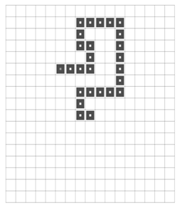

## 문제

Zakhar is playing a version of the Snake game, on an infinite grid, with an infinitely long snake, to get more comfortable with infinity. The snake begins as one square, at an arbitrary location, on the infinite grid. In each move, the snake grows by one square (an empty square adjacent to its head square, the choice of which is within the player's control), and that new square becomes its head square. The snake's tail never moves. Indeed, once the snake occupies a square, a part of the snake will stay in that square forever. Zakhar is generally enjoying the infinite playability of this game.

Zakhar tends to experience absence seizures, lasting a few moments each. (He doesn't notice them.) His little sister, Alyona, wants to play a trick on Zakhar during one of his lapses of consciousness. Alyona wants to control the snake into a situation such that the snake becomes doomed to crash into itself. It would be boring just to crash it; she wants to see Zakhar inevitably crash the snake at some finite time in the future. Alyona must be as quick as possible, since Zakhar could come out of his absence seizure at any moment.

## 입력

The input consists of many test cases. Each test case begins with an integer T, on a line by itself, that describes the number of moves before Zakhar has an absence seizure. The next line contains T pairs, where each pair is a positive integer, R, followed by one character from the set {'N', 'E', 'W', 'S'}. The character indicates the direction (north, east, west, south) and R is the number of steps the snake has taken in that direction.

For example, if T=1, R=1 and the character is 'N', this means that Zakhar has an absence seizure after the snake is two squares long, and the head square is to the north of the tail square. Alyona could then choose for the snake to move north, east, or west, for the next turn.

It is guaranteed that the input will be such that:

* The total number of steps the snake takes in a given test case will never exceed 37, and
* the snake never intersects itself.

The input will be terminated by a zero on a line by itself, which is not to be processed.

## 출력

For each test case, print the smallest number of moves that Alyona has to make, to ensure that the snake is doomed. (That is: after Alyona's moves, the snake has not yet crashed into itself, but it is guaranteed that the snake will eventually crash in a finite number of moves.)
