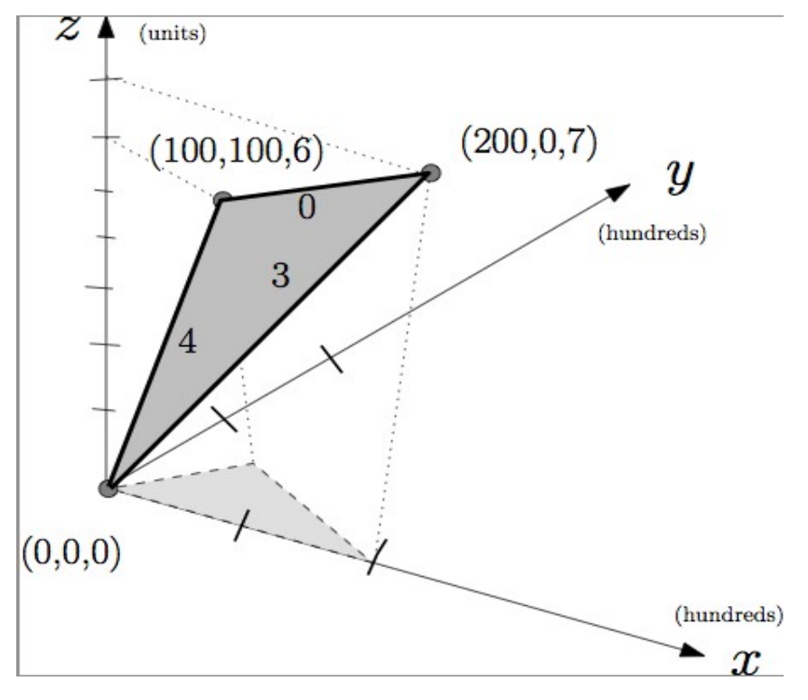

## 문제

In preparation for the coming Olympics, you have been asked to propose bicycle training routes for your country's team. The training committee wants to identify routes for traveling between pairs of locations in multiple sites around the country. Each route must have a desired level of difficulty based on the steepness of its hills.

You will be given a road map with the elevation data superimposed upon it. Each intersection, where two or more roads meet, is identified by its x- , y- , and z-coordinates. Each road starts and ends at an intersection, is straight, and does not contain bridges over or tunnels under other roads. The difficulty level, d, of cycling a road is 0 if the road is level or travelled in the downhill direction. The difficulty of a non-level road when travelled in the uphill direction is ⌊100\*rise / run⌋. Here rise is the absolute value of change in elevation and run is the distance between its two intersection points in its horizontal projection to the 2D-plane at elevation zero. Note that the level of difficulty for cycling a descending road is zero.

A route, which is a sequence of roads such that a successor road continues from the same intersection where its predecessor road finishes, has a level of difficulty d if the maximum level of difficulty for cycling among all its roads equals d. The committee is also interested in the chosen route between two selected locations, if such a route with the desired difficulty level exists, being the one with the shortest possible distance to travel.

Reminder: The floor function ⌊X⌋ means X truncated to an integer.

The figure shows a road map with three intersections for the three sample inputs.

The edge labels of the darker shaded surface give the level of difficulty of going up hill. The lighter shaded surface is the horizontal projection to the 2D-plane at elevation zero.

## 입력

Input consists of many road maps. Each map description begins with two non-negative integers N and M, separated by a space on a line by themselves, that represent the number of intersections and the number of roads, respectively. 0 < N, M ≤ 10000. A value of both N and M equal to zero denotes the end of input data.

Each of the next N lines contains three integers, separated by single spaces, which represent the x-, y- and z-coordinates of an intersection. The integers have values between 0 and 10000, inclusive. Intersections are numbered in order of their appearance starting with the value one. Each of the following M lines contains two integers that represent start and end intersections of a road.

Finally, three integers s, t and d that represents the desired starting intersection number s, the finishing intersection number t and the level of difficulty d for a training route are given on line by themselves. A valid training route must have at least one road with a difficulty level of d, and no road with a difficulty level greater than d. 0 ≤ d ≤ 10. If the training route is meant to form a closed circuit, then s and t are the same intersection numbers.

## 출력

For each road map and desired route, the output consists of a single line that contains:

1. number denoting the shortest length of a training route rounded to three decimal places (where trailing zeros may be omitted), or
2. the single word “None” if no feasible route exists.

## 힌트

Reminder: Rounding a positive number R.xxxy to three decimal places

* If the fourth decimal place is less than 5, then the rounded value is R.xxx
* Otherwise, the rounded value is R.xxx + 0.001

Examples are: for the value of 10.3463 the output should be 10.346, and for the value of 10.3695 the output is either 10.37 or 10.370
