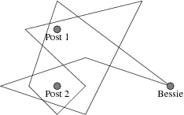

## 문제

As we all know, Bessie the cow likes nothing more than causing mischief on the farm. To keep her from causing too much trouble, Farmer John decides to tie Bessie down to a fence with a long rope. When viewed from above, the fence consists of N posts (1 <= N <= 10) that are arranged along vertical line, with Bessie's position (bx, by) located to the right of this vertical line. The rope FJ uses to tie down Bessie is described by a sequence of M line segments (3 <= M <= 10,000), where the first segment starts at Bessie's position and the last ends at Bessie's position. No fence post lies on any of these line segments. However, line segments may cross, and multiple line segments may overlap at their endpoints.

Here is an example of the scene, viewed from above:

To help Bessie escape, the rest of the cows have stolen a saw from the barn. Please determine the minimum number of fence posts they must cut through and remove in order for Bessie to be able to pull free (meaning she can run away to the right without the rope catching on any of the fence posts).

All (x,y) coordinates in the input (fence posts, Bessie, and line segment endpoints) lie in the range 0..10,000. All fence posts have the same x coordinate, and bx is larger than this value.

## 입력

* Line 1: Four space-separated integers: N, M, bx, by.
* Lines 2..1+N: Line i+1 contains the space-separated x and y coordinates of fence post i.
* Lines 2+N..2+N+M: Each of these M+1 lines contains, in sequence, the space-separated x and y coordinates of a point along the rope. The first and last points are always the same as Bessie's location (bx, by).

## 출력

* Line 1: The minimum number of posts that need to be removed in order for Bessie to escape by running to the right.

## 힌트

#### Input Details

There are two posts at (2,3) and (2,1). Bessie is at (6,1). The rope goes from (6,1) to (2,4) to (1,1), and so on, ending finally at (6,1). The shape of the rope is the same as in the figure above.

#### Output Details

Removing either post 1 or post 2 will allow Bessie to escape.
