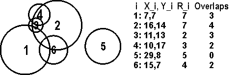

## 문제

Bessie and her fellow herd-mates have become extremely territorial. The N (1 <= N <= 400) cows conveniently numbered 1..N have all staked out a grazing spot in the pasture. Each cow i has a spot on an integer grid (0 <= X\_i <= 10,000; 0 <= Y\_i <= 10,000) and an integer radius R\_i that indicates the circle she is staking out (1 <= R\_i <= 500).

The cows are a bit greedy and sometimes stake out territory of their herd-mates. For each cow, calculate the number of other cows whose territory overlaps her territory.

By way of example, consider these six cows with indicated locations and radii (don't confuse radius with diameter!):

By visual inspection, we can see and count the overlaps, as shown.

NOTE: the test data will avoid pathological situations like tangents where the circles just barely touch.

## 입력

* Line 1: A single integer: N
* Lines 2..N+1: Three space-separated integers: X\_i, Y\_i, and R\_i

## 출력

* Lines 1..N: Line i contains a single integer that is the number of other fields that overlap with cow i's field.
