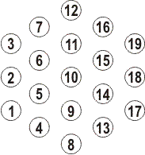

## 문제

Farmer John recently acquired some new land to expand his farm. His cows have taken a liking to the hexagonal structure of bee honeycombs, and, ever willing to please his herd, Farmer John has set up a new system of pastures and cowpaths in this format.

The full plot of pastures and cowpaths forms a hexagon with side length K (2 <= K <= 50). Pastures are conveniently numbered 1..3\*K\*(K-1)+1 starting in the bottom left and ending in the upper right using the pattern generalized from this illustration where K = 3:

Each pasture is connected to all of its immediate neighbors. This means that if a pasture is on the inside of the hexagon, it is adjacent to exactly six other pastures. For example, in the diagram above, pasture #10 is adjacent to pastures #5, #6, #11, #15, #14, and #9. Pastures on the edge (but not on a corner) of the structure are adjacent to exactly four other pastures (for example, pasture #4 is adjacent to #1, #5, #9, and #8) while pastures at a corner are adjacent to only three pastures (e.g., pasture #1 is connected to pastures #2, #5, and #4). The length of any cowpath connecting two pastures is 1 and the distance between two pastures is defined to be the length of the shortest possible route between them.

Farmer John's Holstein cows have been munching on the grass in pasture H (1 <= H <= 3\*K\*(K-1)+1) for several days now and have grown fat and lazy. To force his cows to get some exercise, Farmer John has laid down tasty cow treats in pastures exactly distance of L (1 <= L <= 2\*K-2) away from the cows. He guarantees the cows that he has placed at least one treat, but he doesn't tell the cows the pastures in which he's placed them.

Please help the cows avoid any unnecessary exercise by printing the number of possible pastures which might hold the treats and a list of those possible pastures in ascending order.

By way of example, suppose K = 3, the Holsteins are in pasture #1, and Farmer John says he's placed some treats in pastures a distance of 2 away.  The possible locations of the treats are pastures #3, #6, #10, #9, and #8, as shown below.

## 입력

* Line 1: Three space-separated integers: K, H, and L

## 출력

* Line 1: A single integer: the number of pastures a distance of L away from pasture H
* Lines 2..N+1: Line i+1 contains the i-th such pasture, printed in ascending order
