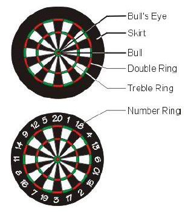

## 문제

Many nations (including Germany) have a strange tradition of throwing small arrows at round flat targets (usually, these small arrows are called darts and so is the game).

In a darts game, the target consists of a flat circle which is divided into slices and rings. The slices are numbered from 1 to 20 and the rings are called double or treble ring (see Figure 5). The center part of the board is called the bull’s eye which is further subdivided into an inner part (the real bull’s eye) and an outer part (called the bull, see Fig. 5).



Figure 5: Layout of a dart board.

Players take turns in throwing the darts at the board. Their score depends on the areas they hit with their darts. Hitting the 20 slice in the double ring scores 2 \* 20 = 40 points. Hitting the treble ring multiplies the score by 3. The inner part of the bull’s eye counts 50, the outer part 25 points.

Every turn consists of 3 darts being thrown at the dartboard by a player and his score is the sum of the scores of all darts which hit the dartboard in one of the numbered areas.

Your friends have played darts yesterday and from their match the scores are still on the blackboard in your room. From reading the scores, you would like to know, how the individual players threw their darts and where they could have hit the dartboard. You are to write a program which, given the score of a turn,reconstructs the number of possible distinct combinations of hits of the three darts on the dartboard ignoring the order in which the darts are thrown.

As an example, consider the overall score of 3 of a player. This could have happened as follows:

```

3 = 0 +    0 +    1*3    one dart hits slice 3
3 = 0 +    0 +    3*1    one dart hits slice 1 in treble ring
3 = 0 +    1*1 +  1*2    one dart hits slice 1 and one dart hits slice 2
3 = 0 +    1*1 +  2*1    one dart hits slice 1 and one dart hits slice 1 in double ring
3 = 1*1 +  1*1 +  1*1    all three darts hit slice 1
```

The resulting sum of possible distinct combinations is 5.

A more complex example is score 9:

```

9 = 0 +    0 +    1*9    one dart hits slice 9
9 = 0 +    0 +    3*3    one dart hits slice 3 in treble ring
9 = 0 +    1*1 +  1*8    one dart hits slice 1 and one dart hits slice 8
9 = 0 +    1*1 +  2*4    one dart hits slice 1 and one dart hits slice 4 in double ring
...
9 = 0 +    3*2 +  1*3    one dart hits slice 2 in treble ring and one dart hits slice 3
9 = 1*1 +  1*1 +  1*7    two darts hit slice 1 and one dart hits slice 7
...
9 = 2*1 +  3*1 +  2*2    one dart hits slice 1 in double ring, one dart hits slice 1 in treble ring and one dart hits slice 2 in double ring
9 = 1*3 +  1*3 +  1*3    three darts hit slice 3
9 = 1*3 +  1*3 +  3*1    two darts hit slice 3 and one dart hits slice 1 in treble ring
9 = 1*3 +  3*1 +  3*1    one dart hits slice 3 and two darts hit slice 1 in treble ring
9 = 3*1 +  3*1 +  3*1    three darts hit slice 1 in treble ring
```

What is the number of combinations? Write a program to find out.

## 입력

The first line contains the number of scenarios.

For each scenario, you are give a dart score as a single positive integer on a line by itself.

## 출력

The output for every scenario begins with a line containing "Scenario #i:", where i is the number of the scenario starting at 1. Then print the number of possible dart score combinations on a line by itself.Finish the output of every scenario with a blank line.
