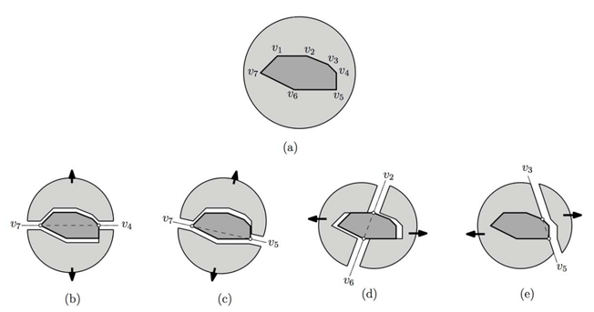

## 문제

Casting is a manufacturing process in which liquid is poured into a cast that has a cavity with the shape of the object to be manufactured. The liquid then hardens, after which the cast is removed. To ensure that the given object can be mass produced by re-using the same case parts, the cast parts must be removed from the object without destroying either the cast parts or the object.

Figure 1.

Figure 1(a) shows an object (dark gray) with its cast (light gray). Our goal is to divide the cast into two parts along a straight line through two vertices of the object such that the cast parts can be removed from the object by translation without destroying either the cast parts or the object. In Figure 1(b), the cast is divided into two parts by the straight line through v4 and v7 such that the upper part is removed vertically upward and the lower part is removed vertically downward from the object without destroying either the cast parts or the object. Figure 1(c) and Figure 2(d) show such divisions by the straight line through v5 and v7, and by the straight line through v2 and v6, respectively. However, not every pair of vertices defines such a division. In Figure 1(e), the left part defined by the straight line through v3 and v5 cannot be removed from the object without destroying either the cast parts or the object.

Given a convex polygon P with n vertices in the plane, your program is to find all pairs (vi, vj) of vertices of P such that both cast parts of P divided by the straight line through (vi, vj) can be removed by translation without destroying either the cast parts or the object.

## 입력

Your program is to read from standard input. The input consists of T test cases. The number of test cases T is given in the first line of the input. Each test case starts with integer n, the number of vertices of a convex polygon P, where 3 ≤ n ≤ 100,000. The next line contains a sequence of 2n integers, x1 y1 x2 y2 ... xn yn, where xi and yi are the x-coordinate and y-coordinate of vertex vi of P, respectively. The coordinates are all integers with -1,000,000,000 ≤ xi ≤ 1,000,000,000 and -1,000,000,000 ≤ yi ≤ 1,000,000,000. Vertices v1, v2, …, vn of P are given in clockwise order along the boundary of P.

## 출력

Your program is to write to standard output. For each test case, print a line containing the number of pairs (vi, vj) of vertices with i < j such that both cast parts of P divided by the straight line through (vi, vj) can be removed by translation without destroying either the cast parts or the object.
