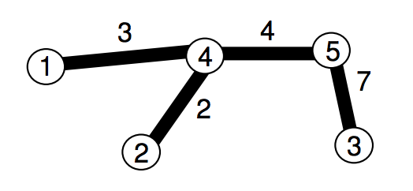

## 문제

재현이는 N개의 정점으로 이루어진 트리를 가지고 있었다. 트리는 1~N까지의 번호가 정점에 매겨져 있었으며, 트리를 잇는 N-1개의 간선에는 두 정점을 잇는 거리가 저장되어 있었다. 재현이는 트리를 좋아하는 만큼 트리에게 많은 메모리를 주기 위해서, 모든 간선을 N\*N 인접 행렬에 저장했다.

애석하게도, 재현이와 인접 행렬을 모두 싫어하는 수찬이가, 플로이드-와셜 알고리즘을 통해 인접 행렬을 채워버리고 말았다. 재현이에게 남은 건, 두 정점간의 최단거리를 저장해놓은 행렬 뿐이다.

재현이는 흉측하게 변해버린 트리를 본 후, 이제 더이상 트리를 좋아하지 않는다. 재현이는 트리에게 많은 메모리를 주고 싶지 않기에, 트리를 인접 리스트에 저장하려고 한다.

수찬이가 플로이드-와셜 알고리즘을 돌린 인접 행렬이 주어졌을 때, 인접 리스트 형태로 원래 트리를 표현해주자.

## 입력

첫 번째 줄에 트리의 정점 수 N이 주어진다. (3 ≤ N ≤ 1024)

이후 N-1개의 줄에 트리의 각 노드간의 최단거리가 인접행렬 형태로 주어진다. 입력 속도를 빠르게 하기 위해서 대각선 위/오른쪽만 주어진다. 즉, 1번 줄에는 2,3 .. N 와의 최단거리, 2번 줄에는 3,4 .. N 와의 최단 거리... 이런 식으로 입력이 주어진다.

모든 거리는 15000을 넘지 않는 양의 정수이다.

## 출력

N개의 줄에 인접 리스트 형태로 트리를 출력하라.

정확히 하자면, i번째 줄에는 해당 노드와 연결되어 있는 정점의 수를 출력하고, 이후 출력한 수만큼 연결된 정점의 번호를 출력하면 된다. 연결된 정점은 오름차순으로 출력되어야 한다.
