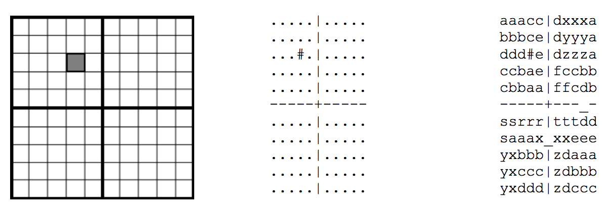
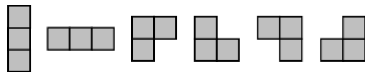

## 문제

Sara is a dedicated farmer owning a large rectangular piece of land. Her land has a number of cells nicely arranged into a grid consisting of 5\*R rows and 5\*C columns. Furthermore, there is a horizontal fence across the width of the board after every fifth row and a vertical fence across the height of the board after every fifth column. The fences divide the land into R\*C 5x5 areas called fields.

The two most common problems Sara faces are birds and droughts. To combat annoying crop-eating birds, some fields are equipped with a scarecrow. A scarecrow (if present) occupies a single cell and there can be at most one scarecrow in each 5x5 field.

Figure 1: Example layout of Sara’s land, its textual representation and a valid sprinkler arrangement

During droughts, which can last for months, Sara uses sprinklers to keep her crops watered. Each of her sprinklers has three nozzles: one main nozzle and two side nozzles. It occupies exactly three cells and waters all of them. The side nozzles always occupy exactly two cells that are adjacent (up, down, left or right) to the main nozzle. Hence, a single sprinkler is always in one of the following configurations:

Sara wants to put sprinklers on her land in such a way that there is exactly one sprinkler on every cell that is not occupied with a scarecrow. A cell containing a scarecrow must not contain a sprinkler nozzle. In addition, nozzles must not be placed outside Sara‟s land.

The three cells watered by a single sprinkler need not belong to the same 5x5 field: they may also belong to the neighboring fields. In that case, Sara has to drill a hole in the fence, between the two cells in neighboring fields watered by the same sprinkler. Drilling a hole is difficult for Sara: she does not want to drill many.

Given the description of Sara‟s land you need to produce a valid configuration of sprinklers to water it. If you succeed, your score will depend on the total number of holes that need to be made in the fences – see the Grading section for details.

This is an output only task. You will be given 10 input files and you only need to produce the matching output files. You may download the input files from the contest system, on the page labeled 'Tasks'.

You need to submit each output file separately using the contest system. When submitting, the contest system will check the format of your output file. If the format is valid, the output file will be graded and the score reported; otherwise, the contest system will report an error. Hence, you will get full feedback for the output files submitted for this task.

Test data will be such that a solution always exists. If there is more than one solution, you may submit any one.

## 입력

The first line of the input contains a pair of integers R and C (1 ≤ R, C ≤ 100) – the size of Sara's land as described above.

6\*R-1 lines follow, each containing a sequence 6\*C-1 characters. They represent Sara"s fields and fences between them. The fence itself is also represented with characters even though the fence is actually infinitely thin.

A single cell is represented by a single character. The dot character "." represents an empty cell, while the "#" character (ASCII 35) represents a scarecrow. Vertical fences are represented by the "|" character (ASCII 124) and the horizontal fences with the "-" character (minus). The "+" character denotes an intersection of fences.

## 출력

The output file should contain the textual representation of the field with a valid sprinkler arrangement in the same format as the input file. Each hole in the fence should be denoted by the underscore character "\_". All empty cells (dots) from the input file should be replaced by lowercase letters "a" – "z" so that the following rules are satisfied:

1. Any three cells watered by the same sprinkler are denoted by the same letter, even if not all of them are in the same 5x5 field.
2. If two adjacent cells in the same field are watered by different sprinklers, they must be denoted by different letters.
3. If two adjacent cells in different fields are watered by different sprinklers and there is a hole in the fence between them, they must be denoted by different letters.
4. It is allowed for adjacent cells that belong to different fields to be denoted by the same letter, as long as all the previous rules are satisfied.

## 힌트

이 문제는 [압축 파일](./001_watering.zip)에 들어있는 watering2.in을 이용해서 채점한다.

올바른 배치인 경우, 점수는 다음과 같이 주어진다:

* 구멍(hole)의 개수가 R\*C 개 보다 많지 않은 경우 100점
* 그렇지 않은 경우 50점
