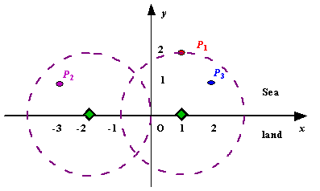

## 문제

Assume the coasting is an infinite straight line. Land is in one side of coasting, sea in the other. Each small island is a point locating in the sea side. And any radar installation, locating on the coasting, can only cover d distance, so an island in the sea can be covered by a radius installation, if the distance between them is at most d.

We use Cartesian coordinate system, defining the coasting is the x-axis. The sea side is above x-axis, and the land side below. Given the position of each island in the sea, and given the distance of the coverage of the radar installation, your task is to write a program to find the minimal number of radar installations to cover all the islands. Note that the position of an island is represented by its x-y coordinates.

Figure A Sample Input of Radar Installations

## 입력

The input consists of several test cases. The first line of each case contains two integers n (1<=n<=1000) and d, where n is the number of islands in the sea and d is the distance of coverage of the radar installation. This is followed by n lines each containing two integers representing the coordinate of the position of each island. Then a blank line follows to separate the cases.

The input is terminated by a line containing pair of zeros

## 출력

For each test case output one line consisting of the test case number followed by the minimal number of radar installations needed. "-1" installation means no solution for that case.
