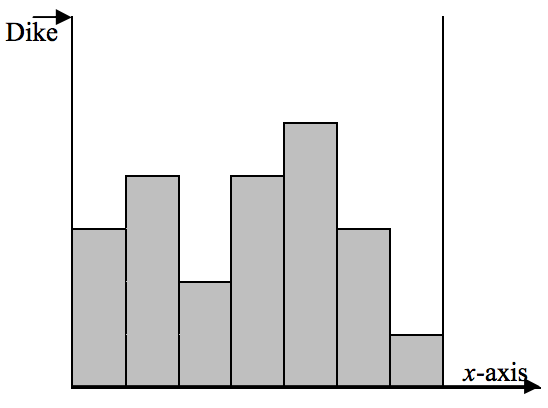

## 문제

Petrus was a boy who saved his village by putting his finger inside a leaking dike all night, despite the cold, until the villagers found him and made the necessary repairs. Another time, the dike has started leaking, but unfortunately Petrus is not alive to save the village. The selfish villagers prefer to collect their belongings and run away. As collecting their belongings takes some time, each one wants to compute the time left for his building to go under water completely.

You can assume that the village is a collection of two-dimensional buildings over the x-axis. The buildings are attached to each other and all have horizontal roofs with the same width of 1 meter, but the roof heights may be different. The dike, located at the beginning of the village, is at least 1 meter taller than all other buildings and is leaking from its top with the rate of 1m2 per minute. There is a wall as high as the dike at the end of the village attached to the last building. You are asked to write a program to help one specific villager to compute the time left for his/her building to go 1 meter under the water.

## 입력

There are multiple test cases in the input. Each test case starts with a line containing an integer n (1 ≤ n ≤ 10,000) where n is the number of buildings. Assume that the dike is based at x-coordinate 0 and start leaking at time 0. The next line contains n space-separated non-negative integers not exceeding 10,000. The ith number is the height of the building constructed at the x-interval [i− 1,i]. Finally, the last line contains the building number for which you have to compute the time left that the building goes 1 meter under the water. You may assume the buildings are numbered from left to right and the leftmost one is numbered 1. The input terminates with a line containing “0”.

## 출력

For each test case, output a line containing the time left (in minutes) that the given building goes 1 meter under water.
