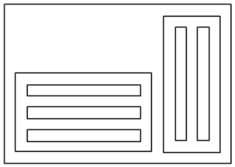

## 문제

A rectangular painting consists of several rectangles that meet the following conditions:

1. Each rectangle is either completely within another rectangle, or it does not overlap with other rectangles.
2. The two sides of each rectangle are parallel to the x and y axes.
3. The sides of any two rectangles are at least d units apart even if one of them contains the other one.
4. For each rectangle, the smallest rectangle containing it is called its super-rectangle. Rectangles with the same super-rectangles are called co-rectangles. All co-rectangles are aligned either vertically or horizontally. Two co-rectangles are horizontally (vertically) aligned if their bottom (left) edges are co-linear.
5. Each rectangle with no inner rectangle is called a photo-rectangle and is filled with a photo of its size.
6. Each rectangular painting has exactly one rectangle with no super-rectangle. This rectangle is called the root rectangle.
7. The coordinates of the rectangle corners are all integer numbers.

Given the structure of a rectangular painting (see input), we want to find the minimum possible area of the root rectangle by selecting the directions of the alignments of all co-rectangles. Note that the dimensions and orientations of the photo-rectangles are given and cannot be changed.

## 입력

There are multiple test cases in the input. Each test case starts with a line containing 1 ≤ n ≤ 100 and 0 ≤ d ≤ 30, where n is the number of rectangles in the rectangular painting. In the next n lines, the ith line is the description of the ith rectangle (rectangle with id i). The root-rectangle id is 1. Let Ri be the id set of rectangles whose super-rectangle is the rectangle with id i. If Ri is not empty, the description of the ith rectangle is the size of Ri followed by the members of Ri all separated with spaces. Otherwise, the rectangle is a photo-rectangle and its description is of form “0 a b” where 1 ≤ a ≤ 30 and 1 ≤ b ≤ 30 are the sizes of its x-axis and y-axis sides, respectively. The input terminates with a line containing “0 0”

## 출력

For each test case, write a single line containing the minimum area of the root rectangle among all possible conformations of the given rectangular painting.

## 힌트

sample output configuration:

