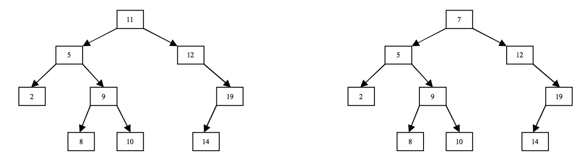

## 문제

Memories in computers are not always fully reliable, and sometimes the content of a memory word can be corrupted. This may be caused by manufacturing defects, power failures, or environmental conditions such as noise and high temperature. Obviously, a memory fault may seriously affect the computation. For instance, assume you maintain a Binary Search Tree (BST) over real numbers in order to perform search operations faster. A BST indeed is a binary tree data structure which has the following properties: for any node with a key x (i) its left sub-tree contains only nodes with key less than x, (ii) its right sub-tree contains only nodes with key greater than x, (iii) both left and right sub-trees are  
BST and (iv) duplicate keys are not permitted. A BST of size 9 is depicted below (left one). If 11 is changed to 7 in the BST due to a memory fault (right figure), the BST is invalid, i.e. some BST properties do not hold anymore. In the invalid BST depicted below (right figure) searching 9 follows a wrong path and reports a wrong answer.

  
To maintain a valid BST, we can verify the BST regularly and transfer it into a valid BST (of course if it is invalid). One easy way to make the BST valid is to select some nodes (not necessarily those whose keys are changed due to memory faults) and change their keys to appropriate keys that make the BST valid. As we are willing to change few keys in the BST, you are to compute the minimum number of nodes whose key can be changed to make the BST valid.

## 입력

There are multiple test cases in the input. For each test case, a BST is given in the following format. The first line contains a single number n ≤ 50,000 which is the size of the BST. In each of next n−1 lines you can find three items separated by spaces which together specify a node. The first item is the key stored at the node, the second one is the key stored at the parent of the node and finally the last one which is either “L” or “R” specifies whether the node is the left (“L”) or the right (“R”) child of its parent. You may assume all keys are non-negative integers (at most 106) and distinct but note that the keys stored in valid BST may be real numbers. The input terminates with a line containing “0”.

## 출력

For each test case, write a single line containing the minimum number of changes that must be applied to the BST to make it valid.
