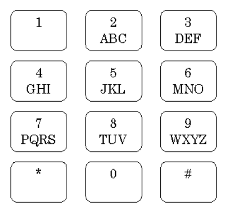

## 문제

This year, ACM scientific committee members use emails to discuss about the problems and edit the selected ones. They know that email is not a secure way of communication, especially on such an important topic. So they transfer password-protected compressed file among themselves. In order to send the passwords, they use SMS. To increase the security level, the encrypted passwords are sent by SMS. To do this, a multi-tap SMS typing method is used.

Multi-tap is currently the most common text input method for mobile phones. With this approach, the user presses each key one or more times to obtain the wanted characters. For example, the key 2 is pressed once to get character A, twice for B, and three times for C.

The encryption algorithm that is used is quite simple: to encrypt the i th character of the password, the key used to obtain that character is tapped i more times. For if the 4th character of password is U, the key 8 is tapped 6 times, getting the character V. Note that to make the problem simple, we have assumed that the keypad does not generate digits.

The scientific committee needs a program to decrypt the received passwords. They are too busy to write this program and have asked you to help! Write a program to get a correct encrypted text and print the original password.

The standard 12 key telephone keypad

## 입력

The input consists of multiple test cases. Each test case contains a non-empty string of length at most 100, consisting of small or capital English letters. The last line of the input contains a single #.

## 출력

For each test case, write the decrypted password in a separate line. Note that passwords are case-sensitive.
