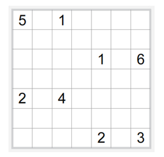
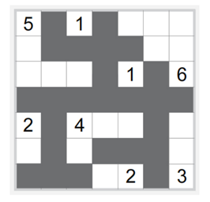

## 문제

희원이는 누리카베 퍼즐을 푸는 프로그램을 만들려고 한다.

누리카베 퍼즐은 직사각형 그리드 상에서 진행되며, 빈 칸과 숫자가 들어있는 칸이 있다. 이 게임을 풀기 위해서는 각 칸이 아래의 조건을 만족시키려면, 흰색(땅)이 될지 검정색(바다)가 될지 결정해야 한다. 섬은 흰 칸으로 최대한 연결된 구역을 말한다.

1. 검정색 칸은 모두 서로 연결되어 있어야 한다.
2. 숫자가 쓰여 있는 칸은 항상 섬의 일부이어야 한다.
3. 섬에 포함되어 있는 칸의 개수는 그 섬이 포함하고 있는 숫자 칸의 숫자와 같아야 한다.
4. 모든 섬에는 숫자 칸이 하나 있어야 한다.
5. 두 섬은 서로 연결되어 있으면 안 된다.
6. 2×2 모양의 검정칸은 만들 수 없다.

칸은 대각선으로 연결될 수 없다. 항상 답이 유일한 경우만 입력으로 주어진다.

## 입력

입력은 여러 개의 테스트 케이스로 이루어져 있다.

각 테스트 케이스의 첫째 줄에는 퍼즐의 크기 n과 m이 주어진다. (3 ≤ n, m ≤ 9)

다음 n개 줄에는 퍼즐의 초기 상태가 주어진다. 빈 칸은 '.'으로, 숫자 칸은 칸에 쓰여 있는 숫자로 주어진다. 칸에 쓰여 있는 숫자는 항상 한 자리이다.

입력의 마지막 줄에는 0이 두 개 주어진다.

## 출력

퍼즐을 푼 상태를 출력한다. 검정칸은 '#'으로 표시한다. 퍼즐과 퍼즐 사이에는 빈 줄을 하나씩 출력한다.
