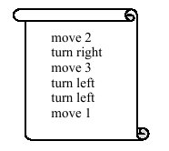
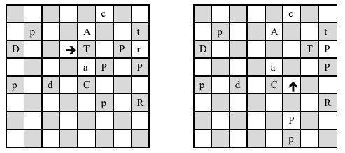

## 문제

Another boring Friday afternoon, Betty the Beetle thinks how to amuse herself. She goes out of her hiding place to take a walk around the living room in Bennett's house. Mr. and Mrs. Bennett are out to the theatre and there is a chessboard on the table! "The best time to practice my chessboard dance," Betty thinks! She gets so excited that she does not note that there are some pieces left on the board and starts the practice session! She has a script showing her how to move on the chessboard. The script is a sequence like the following example:

  
At each instant of time Betty, stands on a square of the chessboard, facing one of the four directions (up, down, left, right) when the board is viewed from the above. Performing a ``move n " instruction, she moves n squares forward in her current direction. If moving n squares goes outside the board, she stays at the last square on the board and does not go out. There are three types of turns: turn right, turn left, and turn back, which change the direction of Betty. Note that turning does not change the position of Betty.

If Betty faces a chess piece when moving, she pushes that piece, together with all other pieces behind (a tough beetle she is!). This may cause some pieces fall of the edge of the chessboard, but she doesn't care! For example, in the following figure, the left board shows the initial state and the right board shows the state after performing the script in the above example. Upper-case and lower-case letters indicate the white and black pieces respectively. The arrow shows the position of Betty along with her direction. Note that during the first move, the black king (r) falls off the right edge of the board!

  
You are to write a program that reads the initial state of the board as well as the practice dance script, and writes the final state of the board after the practice.

## 입력

There are multiple test cases in the input. Each test case has two parts: the initial state of the board and the script. The board comes in eight lines of eight characters. The letters r, d, t, a, c, p indicate black pieces, R, D, T, A, C, P indicate the white pieces and the period (dot) character indicates an empty square. The square from which Betty starts dancing is specified by one of the four characters <, >, ^, and v which also indicates her initial direction (left, right, up, and down respectively). Note that the input is not necessarily a valid chess game status.

The script comes immediately after the board. It consists of several lines (between 0 and 1000). In each line, there is one instruction in one of the following formats (n is a non-negative integer number):

move n   
turn left   
turn right   
turn back

At the end of each test case, there is a line containing a single # character. The last line of the input contains two dash characters.

## 출력

The output for each test case should show the state of the board in the same format as the input. Write an empty line in the output after each board.
