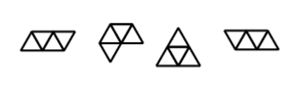

## 문제

피자햇에서 각 조각이 삼각형 모양인 삼각형 피자를 출시했다.

삼각형 피자는 크기가 같은 정삼각형으로 이루어져 있고, 모든 삼각형은 연결되어져 있다. 두 삼각형이 변을 공유하는 경우에 직접 연결되어있다고 한다.

총 N조각으로 이루어진 삼각형 피자의 서로 다른 모양의 수를 구하는 프로그램을 작성하시오.

한 모양을 회전, 이동 시켜서 다른 모양과 완전히 겹칠 수 있다면, 두 모양은 같은 모양이다.

## 입력

첫째 줄에 테스트 케이스의 개수 T가 주어진다. 각 테스트 케이스는 삼각형 피자의 조각의 수 N으로 이루어져 있다. (1 ≤ N ≤ 16)

## 출력

각 테스트 케이스에 대해서, 가능한 피자 모양의 개수를 출력한다.

## 힌트

