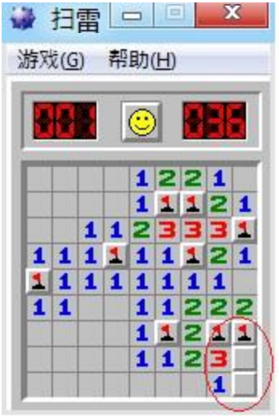

## 문제

The Windows Minesweeper (WinMine) is one of the most well-known games on the Windows system. The rule is quite easy and it takes only a few minutes to play a set. First of all, let’s briefly introduce this game (if you believe that you are familiar enough with this game, you can skip the next paragraph):

> The goal of the game is to uncover all the squares that do not contain mines (with the left mouse button) without being "destroyed" by clicking on a mine. The location of the mines is discovered by a process of logic. Clicking on the game board will reveal what is hidden underneath the chosen square or squares (a large number of blank squares may be revealed in one go if they are adjacent to each other). Some squares are blank but some contain numbers (1 to 8), each number being the number of mines adjacent to the uncovered square. The game is won once all blank squares have been uncovered without hitting a mine, any remaining mines not identified by flags being automatically flagged by the computer. The distinctive feature of minesweeper is the randomness at the initial stage and at some intermediate stages.
>
> ----Wikipedia

Jaddy loves playing WinMine at free time very much due to its simplicity and ingenuity. However, sometimes it makes him frustrated when he reaches some undeterminable states during the game. See the following state as an example:

In the red circle of this example, the rest two squares are absolutely undeterminable and there are apparently two possible distributions of the rest ONE mine.

When Jaddy gets into this kind of trouble, he has no choice but to guess. Sometimes there are only two possible choices (as what the example says) but sometimes there are many. This way, he needs an assistant of this game to calculate the number of different possible distributions of mines depending on the current state of game board.

This assistant of game is pretty useful and interesting, at least for him, so that he immediately starts coding. Unfortunately, Jaddy spent all the time to play WinMine in the class of Programming and Algorithm, so he feels such a complex task is a mission impossible. Jaddy loves WinMine very much so that he asks you, an excellent programmer, for help. In addition, in order to reduce the difficulty, he added two constraints:

1. It is guaranteed that the input state of game can always be created by making only ONE click on the initial board.
2. In the given state, if two unrevealed squares are connected directly or by any other unrevealed squares, they are also bi-connected. That is to say, even after any one of the other unrevealed squares is removed, these two squares are still connected. Here we say two squares are connected if and only if they share an edge. That means a square has at most four squares connected.

Help Jaddy please!

## 입력

There are multiple test cases, the first line of input is a positive integer T (T ≤ 50) indicating the number of test cases. Then T cases follow. For each test case, the first line contains three positive integers n, m and w where 1 ≤ n, m ≤ 100 and 1 ≤ w ≤ 1000 denoting the number of rows and columns in the given board and the total number of mines on the board. Then an n\*m matrix of chars describing the current state of board will be given. In this matrix, there are 2 styles of symbols:

digits from 0 to 8: that means the number of mines around this square (‘0’ implies a blank square).  
‘.’ (quotes for clarifying): that means this square is unrevealed.

## 출력

For each test case, output an integer leading by the case number, denoting the number of possible distribution of mine in the given state, module by 1000003. See the sample output for further details.
