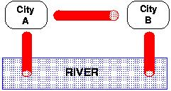

## 문제

River polution control is a major challenge that authorities face in order to ensure future clean water supply. Sewage treatment plants are used to clean-up the dirty water comming from cities before being discharged into the river.

As part of a coordinated plan, a pipeline is setup in order to connect cities to the sewage treatment plants distributed along the river. It is more efficient to have treatment plants running at maximum capacity and less-used ones switched off for a period. So, each city has its own treatment plant by the river and also a pipe to its neighbouring city upstream and a pipe to the next city downstream along the riverside. At each city's treatment plant there are three choices:

* **either** process any water it may receive from one neighbouring city, together with its own dirty water, discharging the cleaned-up water into the river;
* **or** send its own dirty water, plus any from its downstream neighbour, along to the upstream neighbouring city's treatment plant (provided that city is not already using the pipe to send it's dirty water downstream);
* **or** send its own dirty water, plus any from the upstream neighbour, to the downstream neighbouring city's plant, if the pipe is not being used.



The choices above ensure that:

* every city must have its water treated somewhere and
* at least one city must discharge the cleaned water into the river.

Let's represent a city discharging water into the river as "V" (a downwards flow), passing water onto its neighbours as ">" (to the next city on its right) or else "<" (to the left). When we have several cities along the river bank, we assign a symbol to each (V, < or >) and list the cities symbols in order. For example, two cities, A and B, can

* each treat their own sewage and each discharges clean water into the river. So A's action is denoted V as is B's and we write "VV" ;
* or else city A can send its sewage along the pipe (to the right) to B for treatment and discharge, denoted ">V";
* or else city B can send its sewage to (the left to) A, which treats it with its own dirty water and discharges (V) the cleaned water into the river. So A discharges (V) and B passes water to the left (<), and we denote this situation as "V<".

We could not have "><" since this means A sends its water to B and B sends its own to A, so both are using the same pipe and this is not allowed. Similarly "«" is not possible since A's "<" means it sends its water to a non-existent city on its left.

So we have just 3 possible set-ups that fit the conditions:

```

         A    B       A > B       A < B 
         V    V           V       V             
  RIVER~ ~ ~ ~ ~     ~ ~ ~ ~ ~   ~ ~ ~ ~ ~RIVER
          "VV"        ">V"         "V<"
```

If we now consider **three** cities, we can determine **8** possible set-ups.

Your task is to produce a program that given the number of cities NC (or treatment plants) in the river bank, determines the number of possible set-ups, NS, that can be made according to the rules define above.

You need to be careful with your design as the number of cities can be as large as 100.

## 입력

The input consists of a sequence of values, one per line, where each value represents the number of cities.

## 출력

Your output should be a sequence of values, one per line, where each value represents the number of possible set-ups for the corresponding number of cities read in the same input line.
