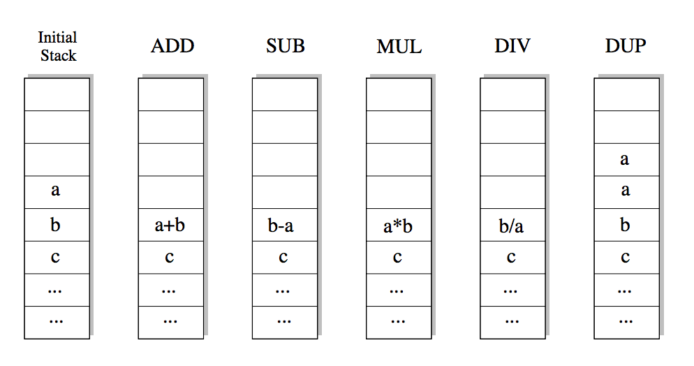

## 문제

As you know, writing programs is often far from being easy. Things become even harder if your programs have to be as fast as possible. And sometimes there is reason for them to be. Many large programs such as operating systems or databases have “bottlenecks” – segments of code that get executed over and over again, and make up for a large portion of the total running time. Here it usually pays to rewrite that code portion in assembly language, since even small gains in running time will matter a lot if the code is executed billions of times.

In this problem we will consider the task of automating the generation of optimal assembly code. Given a function (as a series of input/output pairs), you are to come up with the shortest assembly program that computes this function.

The programs you produce will have to run on a stack based machine, that supports only five commands: ADD, SUB, MUL, DIV and DUP. The first four commands pop the two top elements from the stack and push their sum, difference, product or integer quotient, respectively, on the stack. The DUP command pushes an additional copy of the top-most stack element on the stack.

So if the commands are applied to a stack with the two top elements a and b (shown to the left), the resulting stacks look as follows:

At the beginning of the execution of a program, the stack will contain a single integer only: the input. At the end of the computation, the stack must also contain only one integer; this number is the result of the computation.

There are three cases in which the stack machine enters an error state:

* A DIV-command is executed, and the top-most element of the stack is 0.
* A ADD, SUB, MUL or DIV-command is executed when the stack contains only one element.
* An operation produces a value greater than 30000 in absolute value.

## 입력

The input consists of a series of function descriptions. Each description starts with a line containing a single integer n (n ≤ 10), the number of input/output pairs to follow. The following two lines contains n integers each: x1, x2, ..., xn in the first line (all different), and y1, y2, ..., yn in the second line. The numbers will be no more than 30000 in absolute value.

The input is terminated by a test case starting with n = 0. This test case should not be processed.

## 출력

You are to find the shortest program that computes a function f, such that f(x) = yi for all i ∈ {1, ..., n}. This implies that the program you output may not enter an error state if executed on the inputs xi (although it may enter an error state for other inputs). Consider only programs that have at most 10 statements.

For each function description, output first the number of the description. Then print out the se- quence of commands that make up the shortest program to compute the given function. If there is more than one such program, print the lexicographically smallest. If there is no program of at most 10 statements that computes the function, print the string “Impossible”. If the shortest program consists of zero commands, print “Empty Sequence”.

Output a blank line after each test case.
