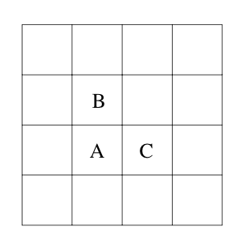

## 문제

InterGames is a high-tech startup company that specializes in developing technology that allows users to play games over the Internet. A market analysis has alerted them to the fact that games of chance are pretty popular among their potential customers. Be it Monopoly, ludo or backgammon, most of these games involve throwing dice at some stage of the game.

Of course, it would be unreasonable if players were allowed to throw their dice and then enter the result into the computer, since cheating would be way to easy. So, instead, InterGames has decided to supply their users with a camera that takes a picture of the thrown dice, analyzes the picture and then transmits the outcome of the throw automatically.

For this they desperately need a program that, given an image containing several dice, determines the numbers of dots on the dice.

We make the following assumptions about the input images. The images contain only three dif- ferent pixel values: for the background, the dice and the dots on the dice. We consider two pixels connected if they share an edge – meeting at a corner is not enough. In the figure, pixels A and B are connected, but B and C are not.

A set s of pixels is connected if for every pair (a,b) of pixel in S, there is a sequence a1, a2, ..., ak in S such that a = a1 and b = ak, and ai and ai+1 are connected for 1 ≤ i < k.

We consider all maximally connected sets consisting solely of non-background pixels to be dice. 'Maximally connected' means that you cannot add any other non-background pixels to the set without making it dis-connected. Likewise we consider every maximal connected set of dot pixels to form a dot.

## 입력

The input consists of pictures of several dice throws. Each picture description starts with a line containing two numbers w and h, the width and height of the picture, respectively. These values satisfy 5 ≤ w,h ≤ 50.

The following h lines contain w characters each. The characters can be: "." for a background pixel, "\*" for a pixel of a die, and "X" for a pixel of a die's dot.

Dice may have different size and not be entirely square due to optical distortion. The picture will contain at least one die, and the numbers of dots per die is between 1 and 6, inclusive.

The input is terminated by a picture starting with w = h = 0, which should not be processed.

## 출력

For each throw of dice, first output its number. Then output the number of dots on the dice in the picture, sorted in increasing order.

Print a blank line after each test case.
