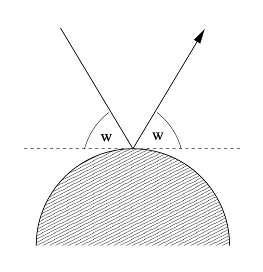
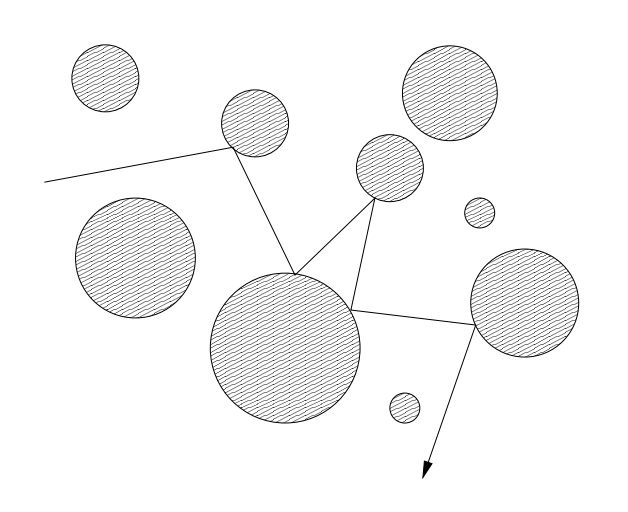

## 문제

Rendering realistic images of imaginary environments or objects is an interesting topic in computer graphics. One of the most popular methods for this purpose is ray-tracing.

To render images using ray-tracing, one computes (traces) the path that rays of light entering a scene will take. We ask you to write a program that computes such paths in a restricted environment.

For simplicity, we will consider only two-dimensional scenes. All objects in the scene are totally reflective (mirror) spheres. When a ray of light hits such a sphere, it is reflected such that the angle of the incoming ray and the leaving ray against the tangent are the same:

The following figure shows a typical path that a ray of light may take in such a scene:

Your task is to write a program, that given a scene description and a ray entering the scene, determines which spheres are hit by the ray.

## 입력

The input consists of a series of scene descriptions. Each description starts with a line containing the number n (n ≤ 25) of spheres in the scene. The following n lines contain three integers xi yi ri each, where (xi, yi) is the center, and ri > 0 is the radius of the i-th sphere. Following this is a line containing four integers x y dx dy, which describe the ray. The ray originates from the point (x, y) and initially points in the direction (dx, dy). At least one of dx and dy will be non-zero.

The spheres will be disjoint and non-touching. The ray will not start within a sphere, and never touch a sphere tangentially.

A test case starting with n = 0 terminates the input. This case should not be processed.

## 출력

For each scene first output the number of the scene. Then print the numbers of the spheres that the ray hits in its first ten deflections (the numbering of spheres is according to their order in the input).

If the ray hits at most ten spheres (and then heads towards infinity), print inf after the last sphere it hits. If the ray hits more than 10 spheres, print three points (...) after the tenth sphere.

Output a blank line after each test case.
