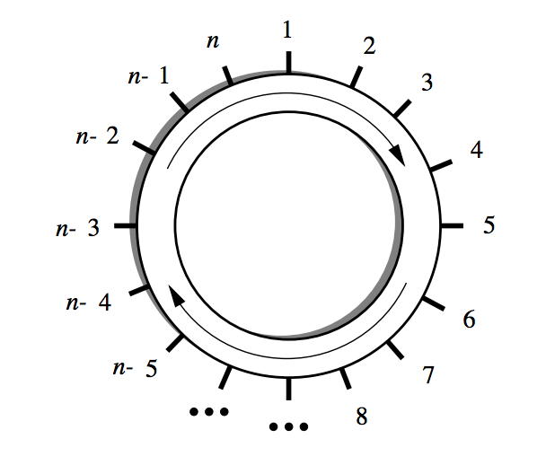

## 문제

In the early 27th century, Alpha Centauri has become the main shipping hub of this part of the galaxy. At a space station near the fourth planet, goods from almost every space-faring civilization are traded and shipped to all major star systems. The space station is shaped like a large circle, and has docking ports on its outer rim, labelled clockwise from 1 to n:

When a trading spaceship docks to a port, it usually makes a request to transfer its cargo to another ship docked to some other port. This task is taken care of by transportation robots (transrobs) operating within the ring of the space station. The transrobs can travel clockwise around the station, and load and unload cargo at the ports.

Every ships cargo fits into one transport container, and all transrobs can carry only one container at a time. The transrobs only differ in maximal weight they can carry.

The consortium operating the space station has recently decided to upgrade its transportation system. But before doing so, they want to gather some statistics on the performance of their current system. More specifically, they are interested in

* the average time it takes for a request to be fulfilled, i.e. the time between a ship requesting a cargo to be taken to another port, and the cargo actually being delivered to its destination, and
* the utilization of the transrobs, i.e. the average percentage of transrobs serving requests during some interval of time

For this, they need a simulation program, which you have to write. To facilitate this task, the consortium has released the following details on their transrob control program.

* The transrobs are numbered 1 to m.
* It takes a transrob 1 minute to get from a port to the next one, and it takes 5 minutes to load or unload a container at a port.
* Transrobs move on different tracks, and therefore do not hinder each other when performing their duties.
* Transrobs are either idle, or they are servicing a request, which means that they move to the origin of that request, load the cargo, move to the destination, unload the cargo, and become idle again.
* All incoming requests are put in the request list. A request from that list is possible to satisfy if there is an idle transrob for which the cargo is not too heavy.
* As long as (or as soon as) there are possible requests on the list, they are assigned to transrobs, giving precedence for older requests over newer requests. Each request is assigned to the transrob which is closest (in anti-clockwise direction) to the origin of the request, and for which the cargo is not too heavy. If there are two transrobs at the same distance, the one with the lower number gets assigned the request. Assigned requests are deleted from the request list.
* The assignment procedure is instantenous, i.e. a robot starts moving in the instant it gets assigned a request, and a robot becomes idle (and can get a new request) in the instant it finishes unloading.

## 입력

The input consists of the description of several simulations you have to perform. Each description starts with a line containing two integers, n and m, the number of ports and transrobs, respectively, satisfying 2 ≤ n ≤ 100 and 1 ≤ m ≤ 20. The next m lines contain a single integer li each, the maximum load that transrob i can carry, measured in galactic tons.

This is followed by one or more shipments to perform. Each shipment is described by a line containing four integers, t, o, d, w: the time t the request was made at (measured in minutes since the beginning of the simulation), the port number o where the shipment comes from (origin), the port number d of the shipment's destination, and the weight w of the container in galactic tons. The request times are in strictly increasing order in the input file. The values satisfy 1 ≤ t, 1 ≤ o, d ≤ n, o ≠ d and 1 ≤ w ≤ max{li | 1 ≤ i ≤ m}.

The description of shipments is terminated by the line “-1 -1 -1 -1”.

The input is terminated by a test case starting with n = m = 0. This test case should not be processed.

## 출력

For each simulation description in the input, first output the number of the description. Then, simulate the operation of the transrobs on the shipment requests and output the average wait time, and the utilization percentage. The utilization percentage is computed for the interval of the time between the first request was made until the moment all requests were satisfied.

At the beginning of the simulation (time 0), all transrobs are idle, and located at port number 1.

All values must be exact to three digits to the right of the decimal point.

Output a blank line after each test case.
