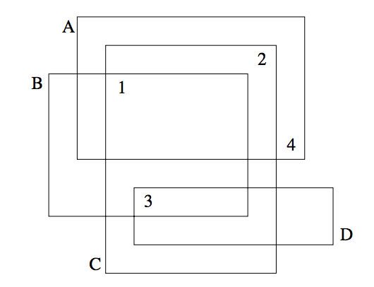

## 문제

Professor Clumsey is going to give an important talk this afternoon. Unfortunately, he is not a very tidy person and has put all his transparencies on one big heap. Before giving the talk, he has to sort the slides. Being a kind of minimalist, he wants to do this with the minimum amount of work possible.

The situation is like this. The slides all have numbers written on them according to their order in the talk. Since the slides lie on each other and are transparent, one cannot see on which slide each number is written.

Well, one cannot see on which slide a number is written, but one may deduce which numbers are written on which slides. If we label the slides which characters A, B, C, ... as in the figure above, it is obvious that D has number 3, B has number 1, C number 2 and A number 4.

Your task, should you choose to accept it, is to write a program that automates this process.

## 입력

The input consists of several heap descriptions. Each heap descriptions starts with a line containing a single integer n, the number of slides in the heap. The following n lines contain four integers xmin, xmax, ymin and ymax, each, the bounding coordinates of the slides. The slides will be labeled as A,B,C,... in the order of the input.

This is followed by n lines containing two integers each, the x- and y-coordinates of the n numbers printed on the slides. The first coordinate pair will be for number 1, the next pair for 2, etc. No number will lie on a slide boundary.

The input is terminated by a heap description starting with n = 0, which should not be processed.

## 출력

For each heap description in the input first output its number. Then print a series of all the slides whose numbers can be uniquely determined from the input. Order the pairs by their letter identifier.

If no matchings can be determined from the input, just print the word none on a line by itself.

Output a blank line after each test case.
