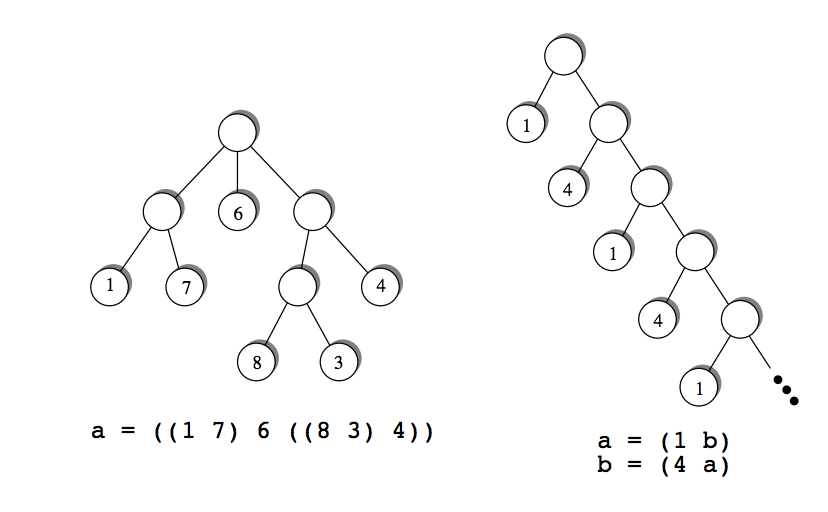

## 문제

Playing games is the most fun if other people take part. But other players are not always available if you need them, which led to the invention of single-player games. One of the most well-known examples is the infamous “Solitaire” packaged with Windows, probably responsible for more wasted hours in offices around the world than any other game.

The goal of a single-player game is usually to make “moves” until one reaches a final state of the game, which results in a win or loss, or a score assigned to that final state. Most players try to optimize the result of the game by employing good strategies. In this problem we are interested in what happens if one plays randomly. After all, these games are mostly used to waste time, and playing randomly achieves this goal as well as any other strategy.

Games can very compactly represented as (possibly infinite) trees. Every node of the tree represents a possible game state. The root of the tree corresponds to the starting position of the game. For an inner node, its children are the game states to which one can move in a single move. The leaf nodes are the final states, and every one of them is assigned a number, which is the score one receives when ending up at that leaf.



Trees are defined using the following grammar.

```

Definition ::= Identifier "=" RealTree
  RealTree ::= "(" Tree+ ")"
      Tree ::= Identifier | Integer | "(" Tree+ ")"
Identifier ::= a | b | ... | z
   Integer  ∈  {..., -3, -2, -1, 0, 1, 2, 3, ..., }
```

By using a Definition, the RealTree on the right-hand side of the equation is assigned to the Identifier on the left. A RealTree consists of a root node and one or more children, given as a sequence enclosed in brackets. And a Tree is either

* the tree represented by a given Identifier, or
* a leaf node, represented by a single Integer, or
* an inner node, represented by a sequence of one or more Trees (its children), enclosed in brackets.

Your goal is to compute the expected score, if one plays randomly, i.e. at each inner node selects one of the children uniformly at random. This expected score is well-defined even for the infinite trees definable in our framework as long as the probability that the game ends (playing randomly) is 1.

## 입력

The input file contains several gametree descriptions. Each description starts with a line containing the number n of identifiers used in the description. The identifiers used will be the first n lowercase letters of the alphabet. The following n lines contain the definitions of these identifiers (in the order a, b, ...). Each definition may contain arbitrary whitespace (but of course there will be no spaces within a single integer). The right hand side of a definition will contain only identifiers from the first n lowercase letters.

The inputs ends with a test case starting with n = 0. This test case should not be processed.

## 출력

For each gametree description in the input, first output the number of the game. Then, for all n identifiers in the order a, b, ..., output the following. If an identifier represents a gametree for which the probability of finishing the game is 1, print the expected score (when playing randomly). This value should be exact to three digits to the right of the decimal point.

If the game described by the variable does not end with probability 1, print “Expected score of id undefined” instead.

Output a blank line after each test case.
