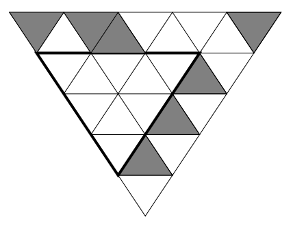

## 문제

It is always very nice to have little brothers or sisters. You can tease them, lock them in the bathroom or put red hot chili in their sandwiches. But there is also a time when all meanness comes back!

As you know, in one month it is Christmas and this year you are honored to make the big star that will be stuck on the top of the Christmas tree. But when you get the triangle-patterned silver paper you realize that there are many holes in it. Your little sister has already cut out smaller triangles for the normal Christmas stars. Your only chance is to find an algorithm that tells you for each piece of silver paper the size of the largest remaining triangle.

Given a triangle structure with white and black fields inside you must find the largest triangle area of white fields, as shown in the following figure.

## 입력

The input file contains several triangle descriptions. The first line of each description contains an integer n (1 ≤ n ≤ 100), which gives the height of the triangle. The next n lines contain characters of the set space, #, - representing the rows of the triangle, where ‘#’ is a black and ‘-’ a white field. The spaces are used only to keep the triangle shape in the input by padding at the left end of the lines. (Compare with the sample input. The first test case corresponds to the figure.)

For each triangle, the number of the characters ‘#’ and ‘-’ per line is odd and decreases from 2n-1 down to 1.

The input is terminated by a description starting with n 0.

## 출력

For each triangle in the input, first output the number of the triangle, as shown in the sample output. Then print the line “The largest triangle area is a.”, where a is the number of fields inside the largest triangle that consists only of white fields. Note that the largest triangle can have its point at the top, as in the second case of the sample input.

Output a blank line after each test case.
