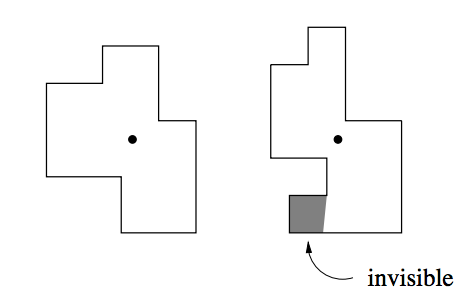

## 문제

A friend of yours has taken the job of security officer at the Star-Buy Company, a famous department store. One of his tasks is to install a video surveillance system to guarantee the security of the customers (and the security of the merchandise of course) on all of the store’s countless floors. As the company has only a limited budget, there will be only one camera on every floor. But these cameras may turn around to look in every direction.

The first problem is to choose where to install the camera for every floor. The only requirement is that every part of the room must be visible from there. In the following figure the left floor can be completely surveyed from the position indicated by a dot, while for the right floor, there is no such position, the given position failing to see the lower left part of the floor.

Before trying to install the cameras, your friend first wants to know whether there is indeed a suitable position for them. He therefore asks you to write a program that, given a ground plan, determines whether there is a position from which the whole floor is visible. All floor ground plans form rectangular polygons, whose edges do not intersect each other and touch each other only at the corners.

## 입력

The input file contains several floor descriptions. Every description starts with the number n of vertices that bound the floor (4 ≤ n ≤ 100). The next n lines contain two integers each, the x and y coordinates for the n vertices, given in clockwise order. All vertices will be distinct and at corners of the polygon. Thus the edges alternate between horizontal and vertical.

A zero value for n indicates the end of the input.

## 출력

For every test case first output a line with the number of the floor, as shown in the sample output. Then print a line stating “Surveillance is possible.” if there exists a position from which the entire floor can be observed, or print “Surveillance is impossible.” if there is no such position.

Print a blank line after each test case.
