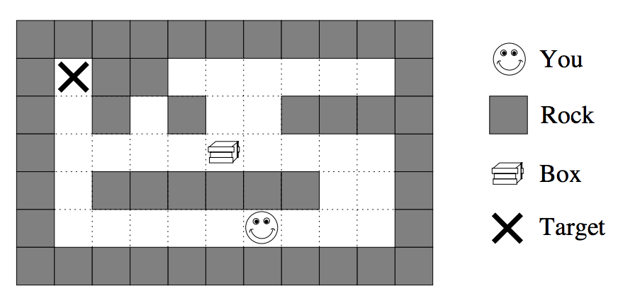

## 문제

Imagine you are standing inside a two-dimensional maze composed of square cells which may or may not be filled with rock. You can move north, south, east or west one cell at a step. These moves are called walks.

One of the empty cells contains a box which can be moved to an adjacent free cell by standing next to the box and then moving in the direction of the box. Such a move is called a push. The box cannot be moved in any other way than by pushing, which means that if you push it into a corner you can never get it out of the corner again.

One of the empty cells is marked as the target cell. Your job is to bring the box to the target cell by a sequence of walks and pushes. As the box is very heavy, you would like to minimize the number of pushes. Can you write a program that will work out the best such sequence?

## 입력

The input file contains the descriptions of several mazes. Each maze description starts with a line containing two integers r and c (both ≤ 20) representing the number of rows and columns of the maze.

Following this are r lines each containing c characters. Each character describes one cell of the maze. A cell full of rock is indicated by a ‘#’ and an empty cell is represented by a ‘.’. Your starting position is symbolized by ‘S’, the starting position of the box by ‘B’ and the target cell by ‘T’.

Input is terminated by two zeroes for r and c.

## 출력

For each maze in the input, first print the number of the maze, as shown in the sample output. Then, if it is impossible to bring the box to the target cell, print “Impossible.”.

Otherwise, output a sequence that minimizes the number of pushes. If there is more than one such sequence, choose the one that minimizes the number of total moves (walks and pushes). If there is still more than one such sequence, any one is acceptable.

Print the sequence as a string of the characters N, S, E, W, n, s, e and w where uppercase letters stand for pushes, lowercase letters stand for walks and the different letters stand for the directions north, south, east and west.

Output a single blank line after each test case.
