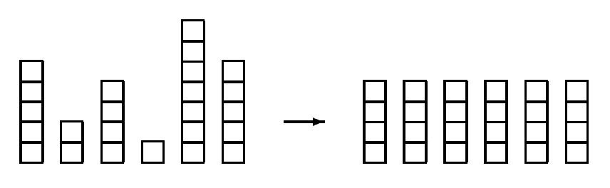

## 문제

Little Bob likes playing with his box of bricks. He puts the bricks one upon another and builds stacks of different height. “Look, I’ve built a wall!”, he tells his older sister Alice. “Nah, you should make all stacks the same height. Then you would have a real wall.”, she retorts. After a little consideration, Bob sees that she is right. So he sets out to rearrange the bricks, one by one, such that all stacks are the same height afterwards. But since Bob is lazy he wants to do this with the minimum number of bricks moved. Can you help?

## 입력

The input consists of several data sets. Each set begins with a line containing the number n of stacks Bob has built. The next line contains n numbers, the heights hi of the n stacks. You may assume 1 ≤ n ≤ 50 and 1 ≤ hi ≤ 100.

The total number of bricks will be divisible by the number of stacks. Thus, it is always possible to rearrange the bricks such that all stacks have the same height.

The input is terminated by a set starting with n 0. This set should not be processed.

## 출력

For each set, first print the number of the set, as shown in the sample output. Then print the line “The minimum number of moves is k.”, where k is the minimum number of bricks that have to be moved in order to make all the stacks the same height.

Output a blank line after each set.
