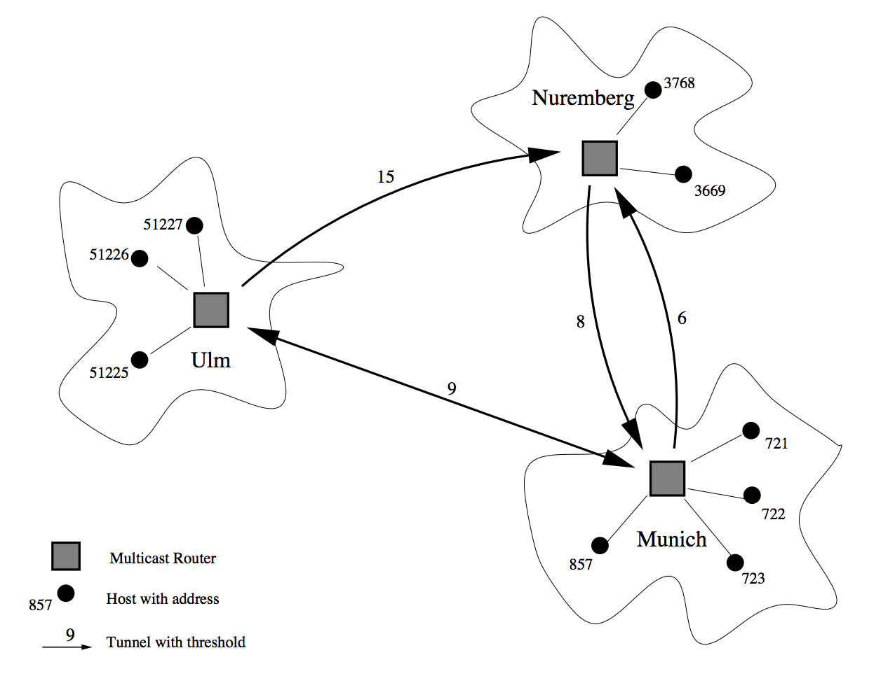

## 문제

MBone is an abbreviation for ‘Multicast Backbone’. It is the realization of a virtual network built on top of the Internet protocol. In contrast to connection-oriented transmission of data (unicast) and the transmission from a sender to all destinations in a network (broadcast) it provides the multicast facility, a facility to send data to all hosts that have joined a so-called ‘multicast group’. All members of a group are able to send data to and receive data from the group.

Your program is to simulate a simplified version of the MBone. In our setting MBone is a combination of multicast routers and hosts, each host belonging to one of the routers. A router and the hosts that belong to it are called an island. Routers are connected via tunnels which are simple communication channels: data packets sent from one side through the tunnel are received on the other side.

In order to become a member of a multicast group, a host must send a protocol message to its corresponding multicast router specifying the address of the group it wants to join. As a consequence the host will receive all data packets sent to this group.

In order to send a data packet to a multicast group, a host sends the packet to the multicast router within its island. Every multicast router duplicates all received packets and sends them through each of its outgoing tunnels. After that it sends copies of the packet to all hosts on its island that have joined the group specified in the packet.

The distribution range of a packet within MBone is restricted through an integer value called TTL (Time To Live) which is assigned to every packet. If a packet is sent through a tunnel its TTL is decremented by the threshold (an integer value) specified for each tunnel. A packet will not be sent over a tunnel if the TTL of the packet is lower than the threshold of the tunnel.

## 입력

The input to your program will consist of several descriptions of MBone networks. The first part of each description defines the network topology, and the second part describes the activities on this network. The first part starts with a line containing a single integer m (1 ≤ m ≤ 10), the number of islands in the network. A value of m = 0 indicates the end of input. The following lines contain the descriptions for the m islands.

Each island description starts with a line containing the name of the multicast router (given as a string of at most 20 non-blank characters) followed by an integer for the number of remaining lines in the island description. These lines can be of two kinds:

* Host belonging to island: H <Host Address>
* Tunnel: T <Threshold> <Dest. Name>

<Host Address> and <Threshold> are positive integer values specifying the address of the host and the threshold of the tunnel, respectively. <Dest. Name> is the name of the destination router at the other end of the tunnel, which is always different from the current router.

The first line of the second part contains a single integer of at most 1000 indicating the number of lines in the following activity description. Each one of these lines describes the activity of a host: join a group, leave a group or send a packet to a group.

* Join a group: J <Host Address> <Group Address>
* Leave a group: L <Host Address> <Group Address>
* Send a packet to a group:S <Host Address> <Group Address> <Packet ID> <TTL>

The <Group Address> , <Packet ID> and <TTL> are positive integer values with the obvious meaning. All names used for the routers and all host addresses used in a scenario, as well as all packet IDs are unique. TTLs of packets will be at most 1000. There will be at most 50 hosts and 100 tunnels in the network and at most 20 active groups (i.e, groups for which there is at least one member host) at any time. No host will try to leave a group that it is not in, nor try to join a group it is in.

## 출력

In the output you have to print the packets received by the hosts in the network for each scenario. If hosts receive multiple copies of a packet (routed via different paths), they keep only the copy with the highest TTL (reaching them via the ‘shortest’ path).

For each network description, first output the number of the network, as shown in the sample output. Each one of the subsequent lines is of the format <Host Address> <Packet ID> <TTL>, meaning that host <Host Address> received the packet having the ID <Packet ID> with the remaining TTL <TTL>. The three entries of the line should be separated by single blank characters. The output must be sorted in ascending order: first by the host address and second by the packet ID.

Output a blank line after each test case.
