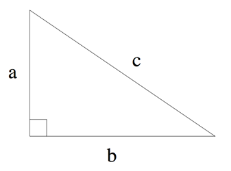

## 문제

컴퓨터를 이용하면 수학 계산이 조금 쉬워진다. 다음과 같은 예를 살펴보자. 세 변의 길이가 a, b, c(c는 빗변)이면서 a2+b2=c2를 만족하는 삼각형을 직각삼각형이라고 한다. 이 공식은 피타고라스의 법칙이라고 한다.

직각 삼각형의 두 변의 길이가 주어졌을 때, 한 변의 길이를 구하는 프로그램을 작성하시오.

## 입력

입력은 여러 개의 테스트 케이스로 이루어져 있다. 각 테스트 케이스는 한 줄로 이루어져 있고, 직각 삼각형의 세 변의 길이 a, b, c가 주어진다. a, b, c중 하나는 -1이며, -1은 알 수 없는 변의 길이이다. 다른 두 수는 10,000보다 작거나 같은 자연수이다.

입력의 마지막 줄에는 0이 세 개 주어진다.

## 출력

각 테스트 케이스에 대해서, 입력으로 주어진 길이로 직각 삼각형을 만들 수 있다면, "s = l"을 출력한다. s는 길이가 주어지지 않은 변의 이름이고, l은 길이이다. l은 소수점 셋째 자리까지 출력한다. 삼각형을 만들 수 없는 경우에는 "Impossible."을 출력한다.
