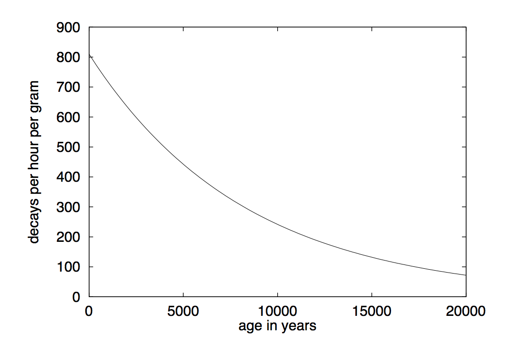

## 문제

Until the second half of the 20th century, determining the actual age of an archaeological find had been more or less a matter of educated guessing. Comparing finds to previous, already dated, ones and evaluation of the surroundings of a find were the best available techniques.

But nowadays, there is a much more reliable method: carbon dating. Carbon dating works as follows: Naturally occurring carbon is a mixture of stable isotopes (mostly 12C) and the unstable, radioactive, isotope 14C. The ratio between the two is almost constant in living organisms: 14C slowly decays, but at the same time, the radiation of the sun produces the same amount in the upper atmosphere, which is taken in by the organisms.

But when, for example, a tree is felled and made to wood, it does not receive any new 14C, and the amount present in the wood becomes less and less due to radioactive decay. In this problem, you are to write a program that uses information about the amount of remaining 14C to determine the approximate age of a sample. The following facts must be used:

* The amount of 14C present in a sample halves every 5730 years (this is called the half-life of 14C).
* The rate of decay (measured in decays per hour per gram of carbon) is proportional to the amount of 14C left in the sample.
* In living organisms (age zero), there are 810 decays per hour per gram of carbon.

So, for example, if we measure in a sample of one gram of carbon 405 decays per hour, we know that it is approximately 5730 years old.

## 입력

The input file contains the measurements taken of several samples we want to date. Every line contains two positive integers, w and d. w is the amount of carbon in the sample, measured in grams, and d is the number of decays measured over one hour.

The input is terminated by a test case starting with w = d = 0.

## 출력

For each sample description in the input, first output the number of the sample, as shown in the sample output. The print the approximate age in the format

**The approximate age is x years.**

If the age is less than 10,000 years, x should be rounded to the closest multiple of 100 years (rounding up in case of a tie). If the age is more then 10,000 years, round it to the closest multiple of 1000 years (again rounding up in case of a tie).

Print a blank line after each sample.
