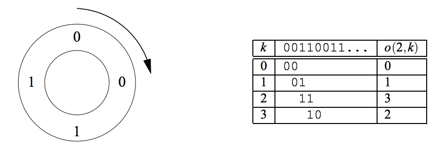

## 문제

Ouroboros is a mythical snake from ancient Egypt. It has its tail in its mouth and continously devours itself.

The Ouroboros numbers are binary numbers of 2n bits that have the property of “generating” the whole set of numbers from 0 to 2n-1. The generation works as follows: given an Ouroboros number, we place its 2n bits wrapped in a circle. Then, we can take 2n groups of n bits starting each time with the next bit in the circle. Such circles are called Ouroboros circles for the number n. We will work only with the smallest Ouroboros number for each n.

Example: for n = 2, there are only four Ouroboros numbers. These are 0011; 0110; 1100; and 1001. In this case, the smallest one is 0011. Here is the Ouroboros circle for 0011:

The table describes the function o(n; k) which calculates the k-th number in the Ouroboros circle of the smallest Ouroboros number of size n. This function is what your program should compute.

## 입력

The input consists of several test cases. For each test case, there will be a line containing two integers n and k (1 ≤ n ≤ 15; 0 ≤ k < 2n). The end of the input file is indicated by a line containing two zeros. Don’t process that line.

## 출력

For each test case, output o(n; k) on a line by itself.
