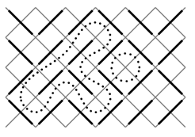

## 문제

By filling a rectangle with slashes (/) and backslashes (\), you can generate nice little mazes. Here is an example:

As you can see, paths in the maze cannot branch, so the whole maze only contains cyclic paths and paths entering somewhere and leaving somewhere else. We are only interested in the cycles. In our example, there are two of them.

Your task is to write a program that counts the cycles and finds the length of the longest one. The length is defined as the number of small squares the cycle consists of (the ones bordered by gray lines in the picture). In this example, the long cycle has length 16 and the short one length 4.

## 입력

The input contains several maze descriptions. Each description begins with one line containing two integers w and h (1 ≤ w,h ≤ 75), the width and the height of the maze. The next h lines represent the maze itself, and contain w characters each; all these characters will be either "/" or "\".

The input is terminated by a test case beginning with w = h = 0. This case should not be processed.

## 출력

For each maze, first output the line "Maze #n:", where n is the number of the maze. Then, output the line "k Cycles; the longest has length l.", where k is the number of cycles in the maze and l the length of the longest of the cycles. If the maze does not contain any cycles, output the line "There are no cycles.".

Output a blank line after each test case.
