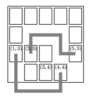

## 문제

One morning, you wake up and think: "I am such a good programmer. Why not make some money?" So you decide to write a computer game.

The game takes place on a rectangular board consisting of  w × h squares. Each square might or might not contain a game piece, as shown in the picture.

One important aspect of the game is whether two game pieces can be connected by a path which satisfies the two following properties:

1. It consists of straight segments, each one being either horizontal or vertical.
2. It does not cross any other game pieces.

It is allowed that the path leaves the board temporarily.

Here is an example:

The game pieces at (1,3) and at (4, 4) can be connected. The game pieces at (2, 3) and (3, 4) cannot be connected; each path would cross at least one other game piece.

The part of the game you have to write now is the one testing whether two game pieces can be connected according to the rules above.

## 입력

The input file contains descriptions of several different game situations. The first line of each description contains two integers w and h (1 ≤ w, h ≤ 75), the width and the height of the board. The next h lines describe the contents of the board; each of these lines contains exactly w characters: a "X" if there is a game piece at this location, and a space if there is no game piece.

Each description is followed by several lines containing four integers x1, y1, x2, y2 each satisfying 1 ≤ x1, x2 ≤ w, 1 ≤ y1, y2 ≤ h. These are the coordinates of two game pieces. (The upper left corner has the coordinates (1, 1).) These two game pieces will always be different. The list of pairs of game pieces for a board will be terminated by a line containing "0 0 0 0".

The entire input is terminated by a test case starting with w=h=0. This test case should not be procesed.

## 출력

For each board, output the line "Board #n:", where n is the number of the board. Then, output one line for each pair of game pieces associated with the board description. Each of these lines has to start with "Pair m: ", where m is the number of the pair (starting the count with 1 for each board). Follow this by "k segments.", where k is the minimum number of segments for a path connecting the two game pieces, or "impossible.", if it is not possible to connect the two game pieces as described above.

Output a blank line after each board.
