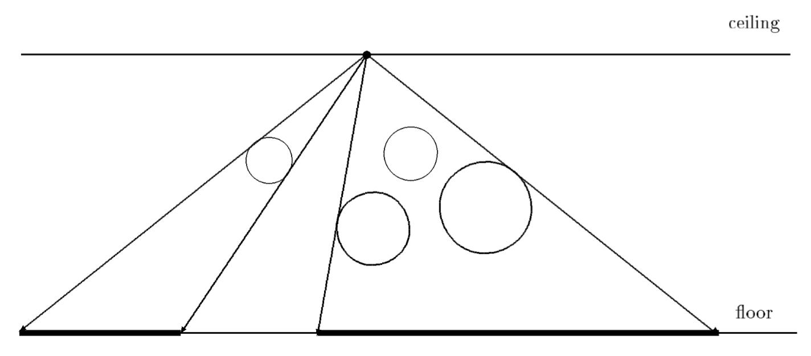

## 문제

In the ceiling in the basement of a newly open developers building a light source has been installed. Unfortunately, the material used to cover the floor is very sensitive to light. It turned out that its expected life time is decreasing dramatically. To avoid this, authorities have decided to protect light sensitive areas from strong light by covering them. The solution was not very easy because, as it is common, in the basement there are different pipelines under the ceiling and the authorities want to install the covers just on those parts of the floor that are not shielded from the light by pipes. To cope with the situation, the first decision was to simplify the real situation and, instead of solving the problem in 3D space, to construct a 2D model first.

Within this model, the x-axis has been aligned with the level of the floor. The light is considered to be a point light source with integer co-ordinates [bx,by]. The pipes are represented by circles. The center of the circle i has the integer co-ordinates [ci,x,ci,y] and an integer radius ri. As pipes are made from solid material, circles cannot overlap. Pipes cannot reflect the light and the light cannot go through the pipes. You have to write a program which will determine the non-overlapping intervals on the x-axis where there is, due to the pipes, no light from the light source.

## 입력

The input consists of blocks of lines, each of which except the last describes one situation in the basement. The first line of each block contains a positive integer number N < 500 expressing the number of pipes. The second line of the block contains two integers bx and by separated by one space. Each of the next N lines of the block contains integers ci,x, ci,y and ri, where ci,y + ri < by. Integers in individual lines are separated by one space. The last block consists of one line containing n = 0.

## 출력

The output consists of blocks of lines, corresponding to the blocks in the input(except the last one). One empty line must be put after each block in the output. Each of the individual lines of the blocks in the output will contain two real numbers, the endpoints of the interval where there is no light from the given point light source. The reals are exact to two decimal places and separated by one space. The intervals are sorted according to increasing x-coordinate.
