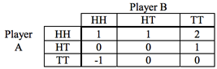
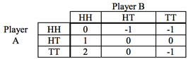

## 문제

Four Quarters is a game of chance played with, well, four quarters. Two people, called A and B, each flip two quarters each round. They each gain or lose points each round based on the following tables:

Player A’s payoff

Player B’s payoff

There is no difference between Heads/Tails and Tails/Heads. As you can see, the odds are stacked in Player A’s favor. At the beginning of the game, each player has 0 points, and points accumulate as the game progresses. At the end of the game, whichever player has the most points wins.

You must write a program that determines the probability that Player A will win, Player B will win, or they will tie, after a certain number of rounds. Assume that the coins are fair, i.e. that heads and tails are equally likely.

## 입력

There is no input file for this problem.

## 출력

Output a table that lists the probability that Player A will win, B will win, or they will tie, after each round for 1 to 20 rounds. The output for rounds 1 through 3 is given below.

Probabilities must be expressed as a percent, with 4 places after the decimal.
