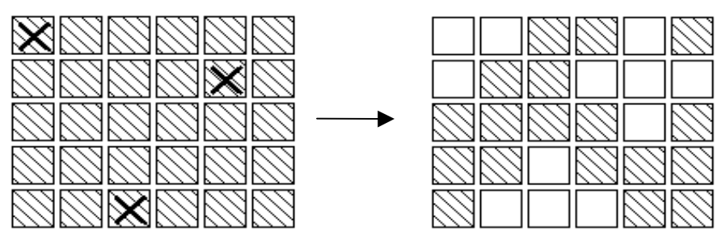
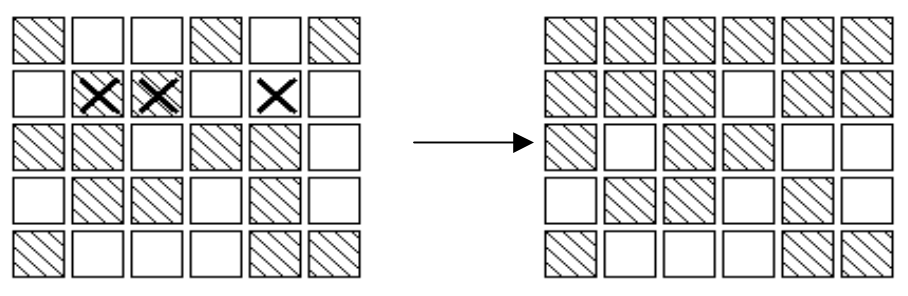

## 문제

In an extended version of the game Lights Out®, is a puzzle with 5 rows of 6 buttons each (the actual puzzle has 5 rows of 5 buttons each). Each button has a light. When a button is pressed, that button and each of its (up to four) neighbors above, below, right and left, has the state of its light reversed. (If on, the light is turned off; if off, the light is turned on.) Buttons in the corners change the state of 3 buttons; buttons on an edge change the state of 4 buttons and other buttons change the state of 5. For example, if the buttons marked X on the left below were to be pressed, the display would change to the image on the right.

The aim of the game is, starting from any initial set of lights on in the display, to press buttons to get the display to a state where all lights are off. When adjacent buttons are pressed, the action of one button can undo the effect of another. For instance, in the display below, pressing buttons marked X in the left display results in the right display. Note that the buttons in row 2 column 3 and row 2 column 5 both change the state of the button in row 2 column 4, so that, in the end, its state is unchanged.

Note:

1. It does not matter what order the buttons are pressed.
2. If a button is pressed a second time, it exactly cancels the effect of the first press, so no button ever need be pressed more than once.
3. As illustrated in the second diagram, all the lights in the first row may be turned off, by pressing the corresponding buttons in the second row. By repeating this process in each row, all the lights in the first four rows may be turned out. Similarly, by pressing buttons in columns 2, 3 …, all lights in the first 5 columns may be turned off.

Write a program to solve the puzzle.

## 입력

The first line of the input is a positive integer n which is the number of puzzles that follow. Each puzzle will be five lines, each of which has six 0’s or 1’s separated by one or more spaces. A 0 indicates that the light is off, while a 1 indicates that the light is on initially.

## 출력

For each puzzle, the output consists of a line with the string: “PUZZLE #m”, where m is the index of the puzzle in the input file. Following that line, is a puzzle-like display (in the same format as the input) . In this case, 1’s indicate buttons that must be pressed to solve the puzzle, while 0’s indicate buttons, which are not pressed. There should be exactly one space between each 0 or 1 in the output puzzle-like display.
