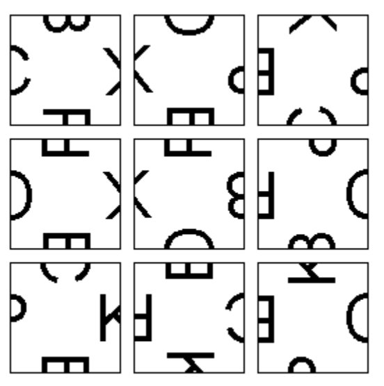
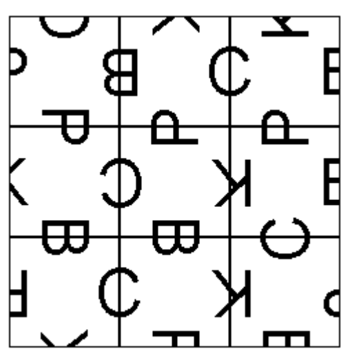

## 문제

One type of picture puzzle consists of nine square pieces, each of which has one-half of a picture on each edge. The pictures on each piece are either the left or the right half of one of four pictures designated B, C, K and P for this problem. The picture halves are aligned along the edges so that, if the left half is on one piece and the right on another, when the two pieces are aligned the pictures match. The purpose of the puzzle is to place the nine pieces into a three by three grid so that all the pictures along the adjacent edges match. Note that some of the pieces may need to be rotated to match.



Example puzzle



Solution

Write a program to solve one or more instances of the puzzle.

## 입력

The input consists of a sequence of problems. Each problem begins with the problem number on a line by itself. The end of the data is indicated by a problem number of 0. Following the problem number line will be nine lines describing the pieces. Each of these lines begins with the piece number (1 through 9) followed by the picture on the top, right side, bottom and left side of the piece, in that order and separated by spaces. The picture halves are BL, BR, CL, CR, KL, KR, PL and PR. BL matches with BR, CL matches with CR, KL matches with KR and PL matches with PR. (For example, BL is the left half and BR is the right half of the picture designated B)

## 출력

The output for each problem is to be: A line with the problem number followed by a colon (‘:’). If the problem has no solution, the next line should be “No Solution”. If there is a solution, that solution should be displayed as follows:

Since any solution may be rotated 90, 180 or 270 degrees to obtain another, the center square should be in the orientation given in the input and other squares aligned accordingly. Each row of pieces is displayed on three lines with a blank line between rows. The format for a single piece is:

```

<3 spaces><2 char top picture><3 spaces>
<2 char left picture><sp><1 digit piece number>><sp><2 char right picture><sp>
<3 spaces><2 char bottom picture><3 spaces>
```

A single blank line should follow the output for each problem.
