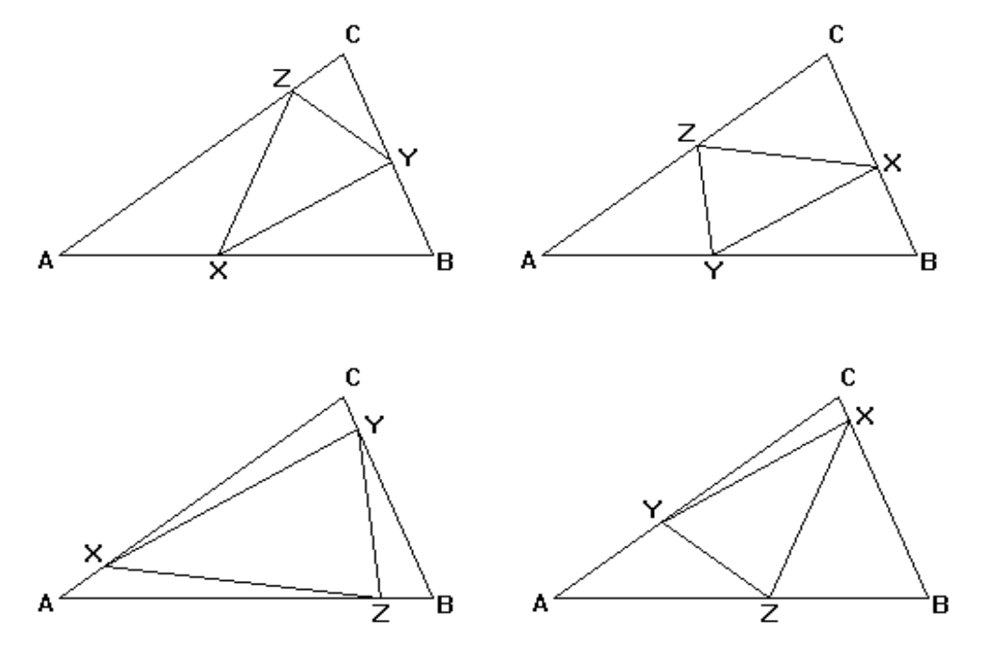

## 문제

Two triangles ABC and XYZ are Similar if their corresponding sides are proportional (or, equivalently if their corresponding angles are equal. We will say that ABC and XYZ are Similar In Order, if A corresponds to X, B corresponds to Y and C corresponds to Z. That is:

|AB|/|XY| = |BC|/|YZ| = |AC|/|XZ|,

where |MN| denotes the length of the line from M to N.

Triangle XYZ is Strictly Inscribed in triangle ABC, if each vertex of XYZ lies in the interior (not at a vertex) of a different edge of ABC. This means that no edge of XYZ can be contained in an edge of ABC. If XYZ is similar in order to ABC and strictly inscribed in ABC, we say that XYZ is a Strictly Inscribed Similar Triangle to ABC.

If the line through X and Y makes an angle θ with the line through A and B, there are four possible orientations illustrated in the figures below. X and Y may be at either end of the segment and the third vertex, Z, may be on either side of the line. In the figures, the line through X and Y makes an angle of 30° with the line through A and B.

Depending on the shape of the outside triangle, ABC, and the angle, θ, between the line through X and Y and the line through A and B, there may be 0, 1, 2, 3 or 4 strictly inscribed similar triangles to ABC with angle θ.

Write a program, which takes as input the vertices of the triangle ABC and an angle θ, and computes the vertices of all strictly inscribed similar triangles to ABC for which the line through X and Y makes an angle θ with the line through A and B.

Use the value: 3.14159253 as the value for π, should you need it.

## 입력

The first line of the input is a positive integer n which is the number of triangle datasets that follow. Each triangle dataset consists of four lines. The first line has the x and y coordinates of vertex A, the second line has the x and y coordinates of vertex B and the third line has the x and y coordinates of vertex C. The last line has the angle θ in degrees between the line through X and Y and the line through A and B.

## 출력

For each dataset, you will output the number of strictly inscribed similar triangles to ABC satisfying the input conditions. Then, for each such triangle, print a blank line, followed by a line containing the coordinates of vertex X (corresponding to A); a line containing the coordinates of vertex Y (corresponding to B); a line containing the coordinates of vertex Z (corresponding to C); and another blank line. Each coordinate should be given to four decimal places.
