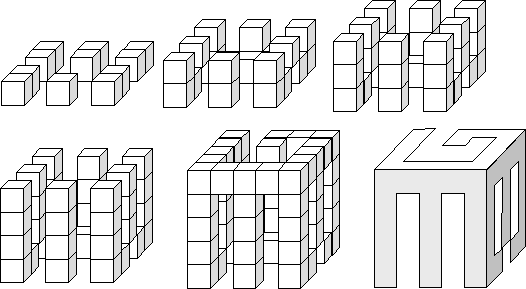

## 문제

Plato believed what we perceive is but a shadow of reality. Recent archaeological excavations have uncovered evidence that this belief may have been encouraged by Plato’s youthful amusement with cleverly-designed blocks. The blocks have the curious property that, when held with any face toward a light source, they cast shadows of various letters, numbers, shapes, and patterns. It is possible for three faces incident to a corner to correspond to three different shadow patterns. Opposite faces, of course, cast shadows which are mirror images of one another.

The blocks are formed by gluing together small cubes to form a single, connected object. As an example, the figures below show, layer by layer, the internal structure of a block which can cast shadows of the letters “E”, “G”, or “B”.

Only a partial set of blocks was discovered, but the curious scientists would like to determine what combinations of shadows are possible. Your program, the solution to this problem, will help them! The program will input groups of shadow patterns, and for each group will report whether or not a solid can be constructed that will cast those three shadows.

## 입력

The input contains a sequence of data sets, each specifying a dimension and three shadow patterns. The first line of a data set contains a positive integer 1 ≤ n ≤ 20 that specifies the dimensions of the input patterns. The remainder of the data set consists of 3n lines, each containing a string of n “X” and “-” characters. Each group of n lines represents a pattern. Where an “X” appears a shadow should be cast by the final solid, and where a “-” appears, light should pass through. For this problem, the input patterns may be assumed to have at least one “X” along each edge of the pattern. The input is terminated by a line containing a single zero in place of a valid dimension.

## 출력

For each data set in the input, output the data set number and one of the following messages:

Valid set of patterns  
Impossible combination

For a set of patterns to be considered valid, it must be possible to construct, by gluing unit cubes together along their faces, a one-piece solid capable of casting the shadow of each of the input patterns.
