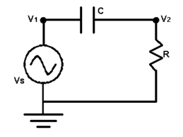

## 문제

Consider the AC circuit below. We will assume that the circuit is in steady-state. Thus, the voltage at nodes 1 and 2 are given by v1 = VS cos ω t and v2 = VR cos ( ωt + θ ) where VS is the voltage of the source, ω is the frequency (in radians per second), and t is time. VR is the magnitude of the voltage drop across the resistor, and θ is its phase.

You are to write a program to determine VR for different values of ω. You will need two laws of electricity to solve this problem. The first is Ohm’s Law, which states v2 = i R where i is the current in the circuit, oriented clockwise. The second is i = C d/dt (v1 – v2) which relates the current to the voltage on either side of the capacitor. “d/dt” indicates the derivative with respect to t.

## 입력

The input will consist of one or more lines. The first line contains three real numbers and a non-negative integer. The real numbers are VS, R, and C, in that order. The integer, n, is the number of test cases. The following n lines of the input will have one real number per line. Each of these numbers is the angular frequency, ω.

## 출력

For each angular frequency in the input you are to output its corresponding VR on a single line. Each VR value output should be rounded to three digits after the decimal point.
