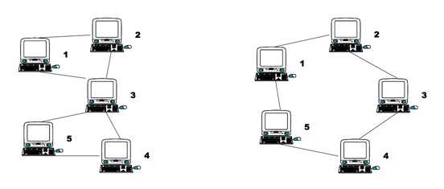

## 문제

Consider the two networks shown below. Assuming that data moves around these networks only between directly connected nodes on a peer-to-peer basis, a failure of a single node, 3, in the network on the left would prevent some of the still available nodes from communicating with each other. Nodes 1 and 2 could still communicate with each other as could nodes 4 and 5, but communication between any other pairs of nodes would no longer be possible. Node 3 is therefore a Single Point of Failure (SPF) for this network. Strictly, an SPF will be defined as any node that, if unavailable, would prevent at least one pair of available nodes from being able to communicate on what was previously a fully connected network. Note that the network on the right has no such node; there is no SPF in the network. At least two machines must fail before there are any pairs of available nodes which cannot communicate.

## 입력

The input will contain the description of several networks. A network description will consist of pairs of integers, one pair per line, that identify connected nodes. Ordering of the pairs is irrelevant; 1 2 and 2 1 specify the same connection. All node numbers will range from 1 to 1000. A line containing a single zero ends the list of connected nodes. An empty network description flags the end of the input. Blank lines in the input file should be ignored.

## 출력

For each network in the input, you will output its number in the file, followed by a list of any SPF nodes that exist. The first network in the file should be identified as “Network #1”, the second as “Network #2”, etc. For each SPF node, output a line, formatted as shown in the examples below, that identifies the node and the number of fully connected subnets that remain when that node fails. If the network has no SPF nodes, simply output the text “No SPF nodes” instead of a list of SPF nodes.
